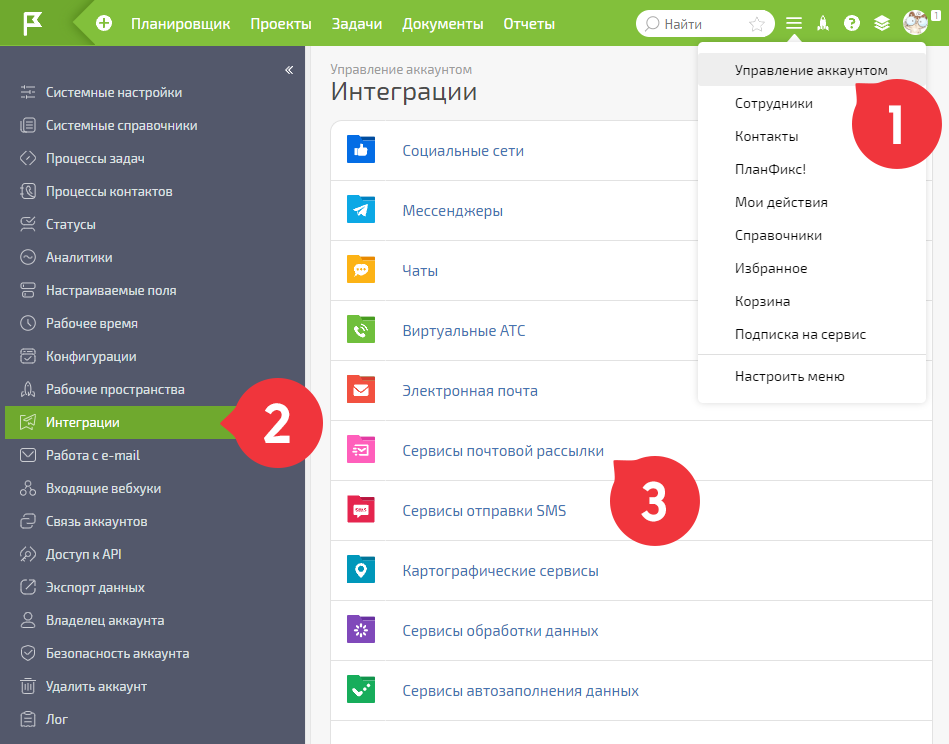
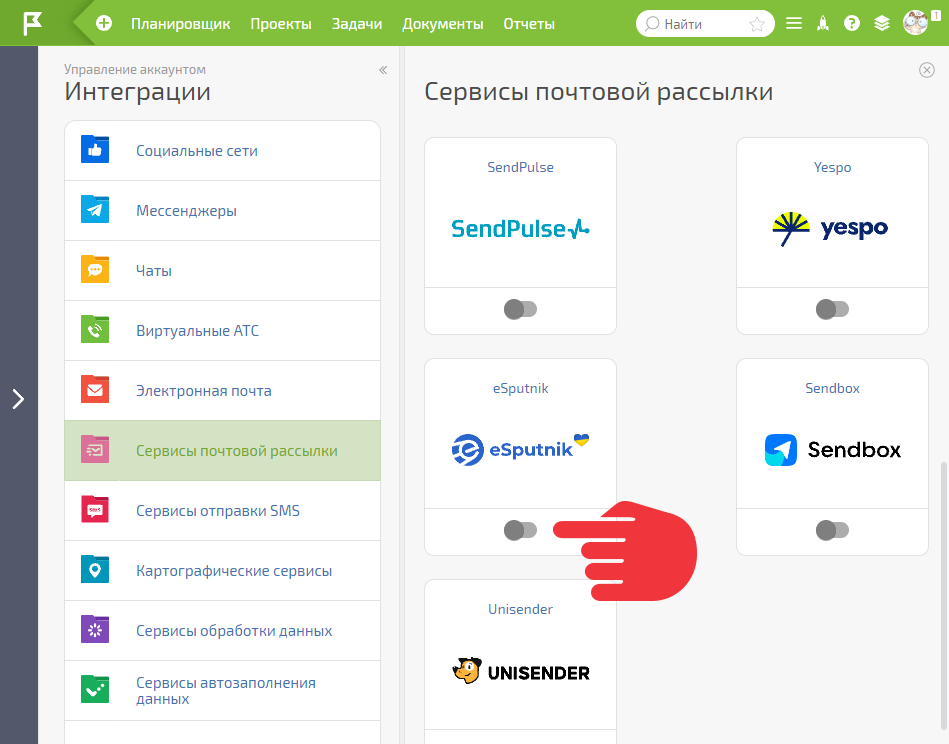
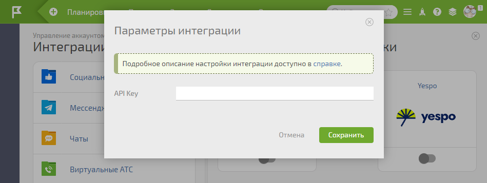
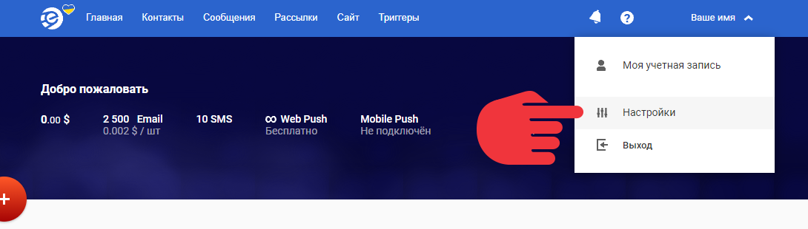
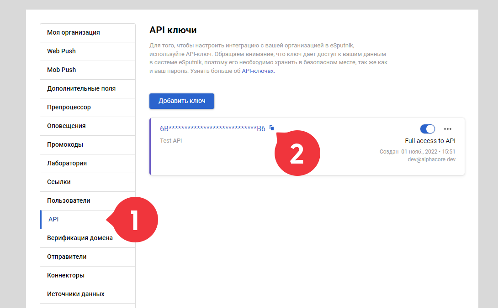
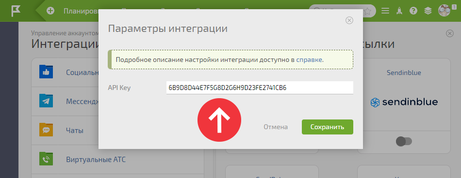

Для включения интеграции с сервисом почтовых рассылок [eSputnik](https://esputnik.com/) перейдите в **Управление аккаунтом** — **Интеграции** — **Интеграции с сервисами почтовых рассылок** : 

  

  * В появившемся списке активируйте eSputnik:

  

  * Откройте в соседней вкладке [eSputnik](https://esputnik.com/) и войдите в него под своей учетной записью. Затем зайдите в настройки:

  

  * Найдите раздел API, добавьте ключ и скопируйте его:

  

  * Вернитесь на страницу интеграции с eSputnik в ПланФиксе и вставьте его в соответствующее поле:

  

Сохраните изменения. После этого в каждом [ фильтре контактов](Фильтры_контактов.md "Фильтры контактов") появится возможность включать [автоматический экспорт отобранных контактов](Сервисы_рассылки_e-mail.md "Сервисы рассылки e-mail") в eSputnik. 

  

## Важно

  * В eSputnik невозможно удалить группы контактов с помощью API, при удалении контактов они остаются пустыми. Их можно удалить только в ручную.
