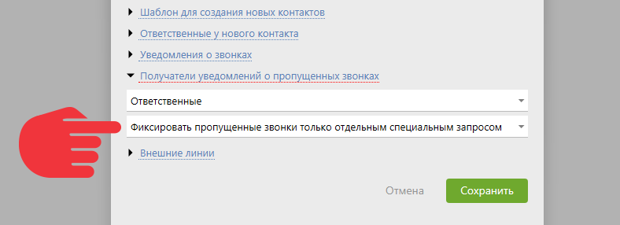

**FreePBX** — это бесплатная программная [телефонная система](Виртуальные_АТС.md "Виртуальные АТС"), которая позволяет управлять звонками в компании. 

## Возможности

  * **Телефонные звонки через интернет** : использует технологию VoIP, что позволяет совершать звонки через интернет вместо обычной телефонной сети.

  * **Автоматическое распределение звонков** : помогает автоматически направлять входящие звонки на нужные номера или отделы внутри компании.

  * **Голосовые меню** : Можно настроить интерактивные голосовые меню, чтобы звонящий мог выбрать нужный отдел, нажимая цифры на телефоне.

  * **Голосовая почта** : Если никто не может ответить на звонок, FreePBX может записать сообщение голосовой почты, которое потом можно прослушать.

  * **Конференц-связь** : Можно организовывать конференц-звонки, чтобы несколько человек могли одновременно участвовать в разговоре.

  * **Запись звонков** : Можно записывать телефонные разговоры для последующего прослушивания или анализа.

  * **Интеграция с другими системами** : FreePBX можно интегрировать с различными CRM-системами, в том числе с ПланФиксом.

## Подключение

FreePBX к ПланФиксу можно подключить 2 способами: 

  * API ПланФикса для телефоний

  * Интеграция FreePBX

Обратите внимание, команда ПланФикса настройкой Астериска на стороне клиента не занимается и не консультирует по таким вопросам. 

## API ПланФикса для телефоний

  * Этим способом можно получать в ПланФикс только события о звонках, т.е. при звонке в активной вкладке ПланФикса появится карточка звонка.

  * Звонить из ПланФикса нельзя.

  * Для того, чтобы получить записи звонков необходимо дополнительно настроить apache/nginx (шаг 5).

  

**Шаг 1**

На сервере отредактируйте файл /etc/asterisk/extensions_override_freepbx.conf ([пример файла](https://p.pfx.so/pf/1Q/nAVvO1.txt)) таким образом, чтобы он обязательно содержал 3 контекста: 

  * [macro-dialout-one-predial-hook]

  * [macro-dialout-trunk-predial-hook]

  * [macro-hangupcall]

Для [macro-hangupcall] необязателен вид, как в примере. 

Найдите в файле extensions_additional.conf контекст [macro-hangupcall] — скопируйте его — в самое начало добавьте строку: 

    

    

    exten => s,1,Macro(hangupcall-send-post)

    

  

**Шаг 2**

Скопируйте в файл extension_custom.conf все контексты из [примера](https://p.pfx.so/pf/ZA/wjntV1.txt). Это можно сделать в том числе с помощью интерфейса FreePBX. 

  

**Шаг 3**

Добавьте в файл globals_custom.conf 3 строки и замените {…} на соответствующие данные: 

  * PBX_URL = {…} — URL-адрес вашей АТС

  * PF_URL = {…} — адрес для принятия запросов

  * PF_KEY = {…} — ключ авторизации (token) ПланФикса

  

**Шаг 4**

  * Перейдите в ПланФиксе в Управление аккаунтом — Интеграции — Виртуальные АТС — API ПланФикса для телефоний.

  * Заполните адрес АТС, чтобы ПланФикс понимал, что нужно принимать события приходящие с этого сайта или адреса.

  

**Шаг 5**

Для получения записей необходимо настроить доступ к ним извне через веб-сервер. Чтобы сделать это, используя Apache, входящий в FreePBX, добавьте ссылку на папку с записями. У папки должен быть нужный владелец, группа и права — 775. 

  * Создаем ссылку

    `ln -s /var/spool/asterisk/monitor /var/www/html/monitor`

  

  * Редактируем права и владельца:

    `chmod -R 775 /var/www/html/monitor/`

    `chown -R asterisk:asterisk /var/www/html/monitor/`

  

Если используется сборка без Apache — сделайте подобную конфигурацию для используемого веб-сервера. 

## Интеграция FreePBX

(FreePBX 16+ / Asterisk 18+) 

Перед началом в файл кастомных настроек extensions_override_freepbx.conf вставьте следующее: 

    

    

    [macro-dialout-trunk-predial-hook]

    exten => s,1,Gosub(planfix-mark-outbound,s,1)

     same => n,MacroExit()

    

    [planfix-mark-outbound]

    exten => s,1,NoOp(Outgoing call from ${CALLERID(all)} to ${EXTEN})

     same => n,Set(__CRM_DIRECTION=OUTBOUND)

     same => n,NoOp(Setting CRM_DIRECTION=${CRM_DIRECTION})

     same => n,Return()

     

    [macro-dialout-one-predial-hook]

    exten => s,1,Gosub(planfix-mark-inbound,s,1)

     same => n,MacroExit() 

     

    [macro-dial-ringall-predial-hook]

    exten => s,1,Gosub(planfix-mark-inbound,s,1)

     same => n,MacroExit()

     

    [planfix-mark-inbound]

    exten => s,1,NoOp(Incoming call to ${EXTEN} from ${CALLERID(all)})

     same => n,Set(__CRM_DIRECTION=INBOUND)

     same => n,NoOp(Setting CRM_DIRECTION=${CRM_DIRECTION})

     same => n,Return()

    

    

  

**Шаг 1**

Откройте FreePBX и добавьте пользователя: Settings — Asterisk REST Interface Users — Add User. 

Заполните следующие поля: 

  * **REST Interface User Name** : Имя пользователя

  * **REST Interface User Password** : Пароль

  * **Password Type** : Plain Text

  * **Read Only** : No

Скопируйте (понадобится в шаге 4) и сохраните. 

  

**Шаг 2**

Добавьте менеджера: Settings — Asterisk Manager Users — Add Manager: 

  * **Name** : Имя

  * **Secret** : Оставьте по умолчанию или добавьте свой

  * Остальные пункты лучше не трогать.

Скопируйте (понадобится в шаге 4 и 6) и сохраните. 

  

**Шаг 3**

Сохраните настройки, нажав Apply Config в правом верхнем углу. 

  

**Шаг 4**

Перейдите в ПланФиксе в Управление аккаунтом — Интеграции — Виртуальные АТС — FreePBX. 

Заполните данные: 

  * **PBX address** : URL-адрес вашей АТС (вместе с протоколом и портом, по которому доступен ARI)

  * **ARI User Name** : Name из шага 1

  * **ARI User Password** : Password из шага 1

Скопируйте URL принимающего скрипта и сохраните интеграцию. 

  

**Шаг 5**

На сервере: 

  * В папке /var/spool/asterisk/ создайте ссылку с названием recording на папку с названием monitor (в той же папке). Команда:

    `ln –s /var/spool/asterisk/monitor /var/spool/asterisk/recording`

  

**Шаг 6**

  * Перейдите в папку /etc/asterisk/

  * Создайте папку scripts, если еще не создавали

  * В папке scripts создайте файл ami_listener.py

  

**Шаг 7**

Заполните файл ami_listener.py по [примеру](https://p.pfx.so/pf/aF/AdEyoi.txt), заменяя: 

  * **Your_user_name** : на Name из шага 2

  * **Your_user_password** : на Secret из шага 2

  * **Your_planfix_endpoint_url** : на URL принимающего скрипта из шага 4

  

**Шаг 8**

Сделайте файл исполняемым с помощью команды: 

`chmod +x /etc/asterisk/scripts/ami_listener.py`

  

**Шаг 9**

  * Перейдите в папку /lib/systemd/system/

  * Создайте файл crm-asterisk-listener.service

  * Заполните файл crm-asterisk-listener.service по [примеру](https://p.pfx.so/pf/D5/5qESf3.txt)

  

**Шаг 10**

Добавьте файл в автозагрузку и запустите сервис с помощью последовательных команд: 

`sudo systemctl enable crm-asterisk-listener`

`sudo systemctl start crm-asterisk-listener`

  

**Работа с Asterisk более старых версий**

Для Asterisk версии 13+ нужно прописать в конфигурационных файлах дополнительные свойства. 

Для /etc/asterisk/cdr.conf 

    

    

    [general]

    enable       = yes

    batch        = no     

    unanswered   = yes

    

Для /etc/asterisk/cdr_manager.conf 

    

    

    [general]

    enable       = yes

    unanswered   = yes 

    

При этом получение записей звонков будет работать только для Asterisk 14+ 

## Дополнительные методы

Вызов данных методов вы можете реализовать самостоятельно с помощью dialplan. 

  

**Получение информации об ответственных**

Вы можете отправить POST-запрос на адрес, указанный в интеграции, который содержит: 

Content-type: application/json  

{"event": "callInfoRespNum", "uniqueId": "уникальный_id_звонка", "intNum": "короткий_номер_АТС", "extNum": "внешний_номер_абонента"}

В ответ получите: 

{"responsibleNumbers":["короткий_номер_ответственного","короткий_номер_второго_ответственного(если есть)"]}

ИЛИ 

Если у контакта: 

    

  * нет ответственных

  * не назначены короткие номера

  * ответственным является сотрудник, на номер которого звонили ("короткий_номер_АТС")

Тогда ответ будет содержать: 

{"error":"no persons responsible"}

  

**Оповещение о пропущенном вызове**

  * Для работы метода в настройках интеграции выберите пункт — «Фиксировать пропущенные звонки только отдельным специальным запросом»:

  

Вы можете отправить POST-запрос на адрес, указанный в интеграции, который содержит: 

Content-type: application/json  

{"event": "callMissedNotify", "uniqueId": "уникальный_id_звонка", "intNum": "короткий_номер_АТС_на_который_будет_отправлено_сообщение_о_пропущенном_вызове", "extNum": "внешний_номер_абонента"} 

Если сотрудник с данным коротким номером существует, ему отправится уведомление о пропущенном вызове. 

Ответ на POST-запрос будет пустым. 

## Особенности работы

  * Для корректной работы скрипта убедитесь, что у вас установлена библиотека "panoramisk". Она устанавливается командой 'pip install panoramisk'.

  

  * Если скрипт сразу не заработал или после выполнения команд вы внесли изменения в ami_listener, могут помочь такие команды:

    `sudo systemctl daemon-reload`

    `sudo systemctl restart crm-asterisk-listener`

  

  * Если необходимо отключить интеграцию, выполните команды:

    `sudo systemctl stop crm-asterisk-listener`

    `sudo systemctl disable crm-asterisk-listener`

  

  * Во всех способах подключения у вас должны быть настроены: 

    * внутренние номера (Extensions)

    * входящая и исходящая маршрутизация (Inbound/Outbound Routes)
