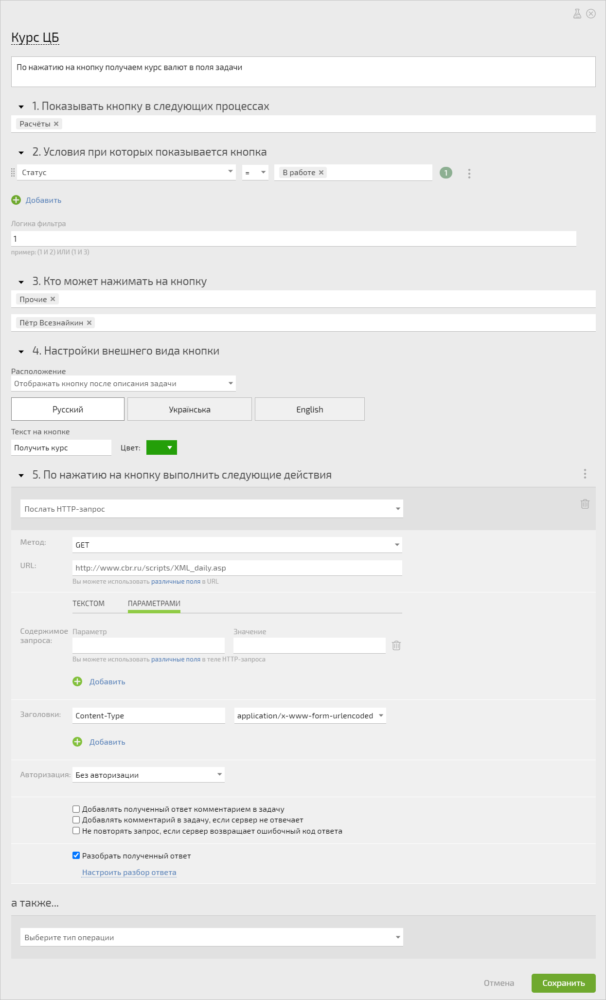
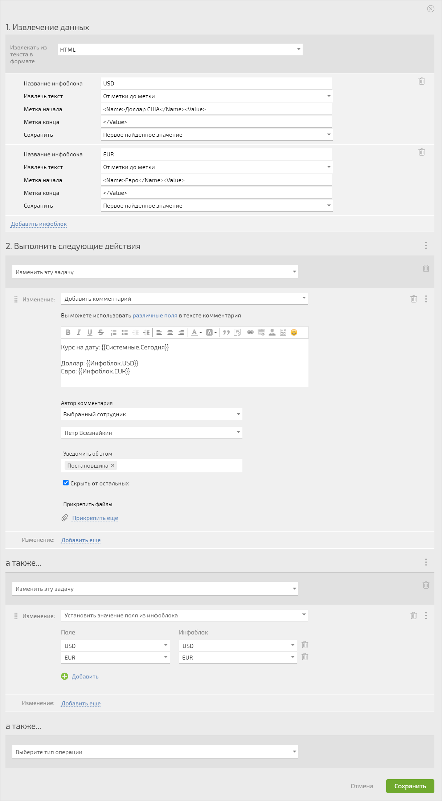
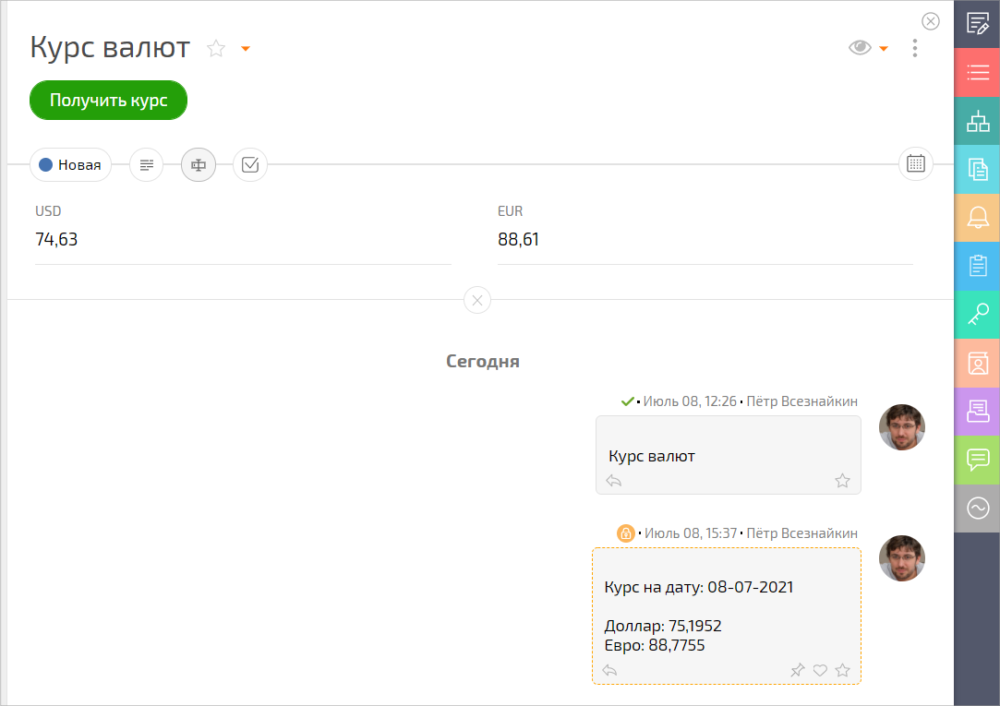

Получите курс валют из ЦБ РФ прямо в ПланФикс с помощью [автоматического сценария](Автоматические_сценарии.md "Автоматические сценарии"). Для настройки используйте XML-данные, которые можно получить на сайте Центробанка России по [ссылке](http://www.cbr.ru/scripts/XML_daily.asp). 

  * Настраиваем кнопку:

  

  * Разбираем ответ от банка:

  

Обратите внимание, разбор ответа происходит так: 

  * В инфоблоки кладем нужные данные из ответа банка.

  * Затем в текущую задачу добавляем комментарий с нужной информацией. Делаем это в качестве контрольной меры. Можно и не добавлять.

  * На последнем шаге данные из инфоблока дублируем в соответствующие поля задачи, чтобы можно было их использовать в дальнейших расчетах.

После клика по кнопке в задаче видим следующее: 

  

## Дополнительная информация

  * [Разбор ответов на HTTP-запросы](https://planfix.com/ru/blog/razbor-otvetov-na-http-zaprosy/)
