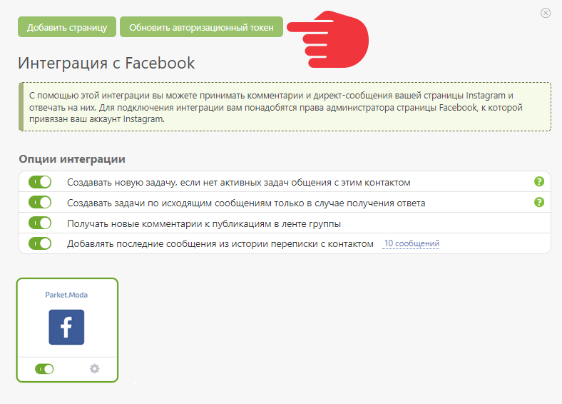
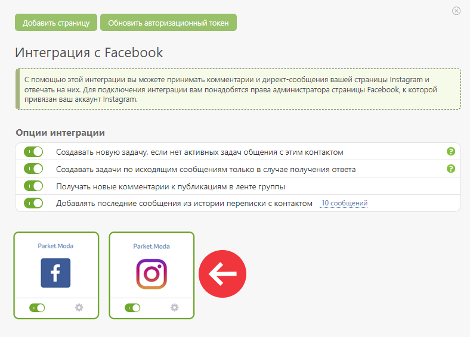
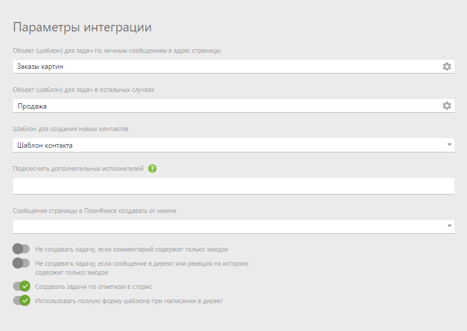
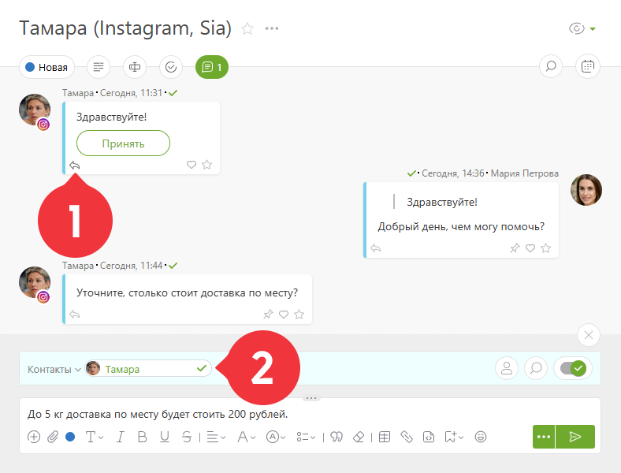
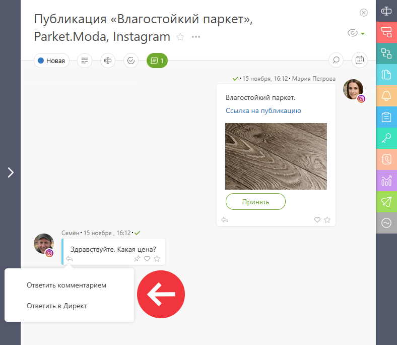
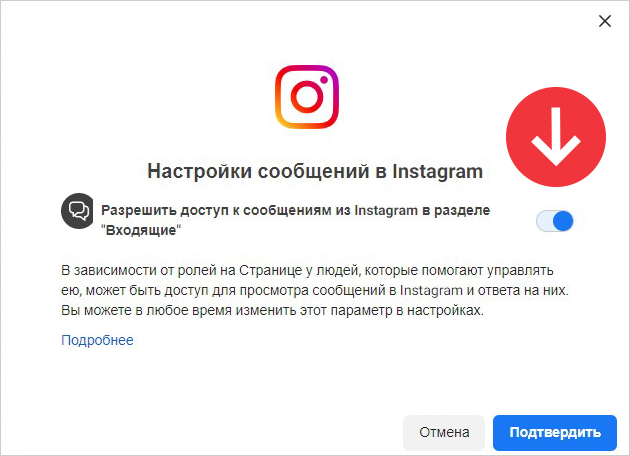
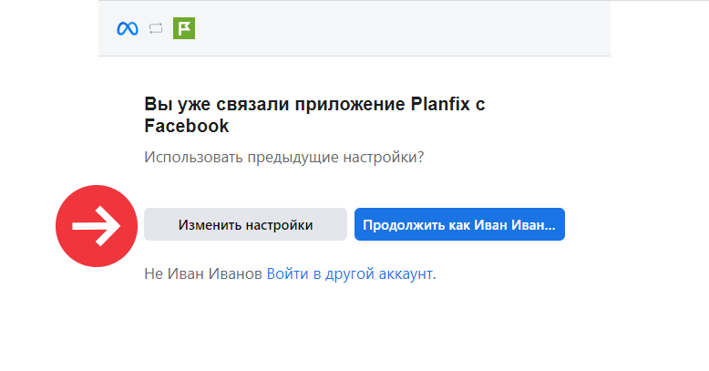
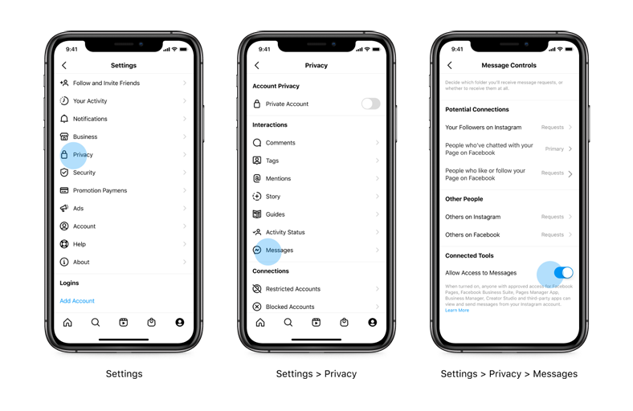
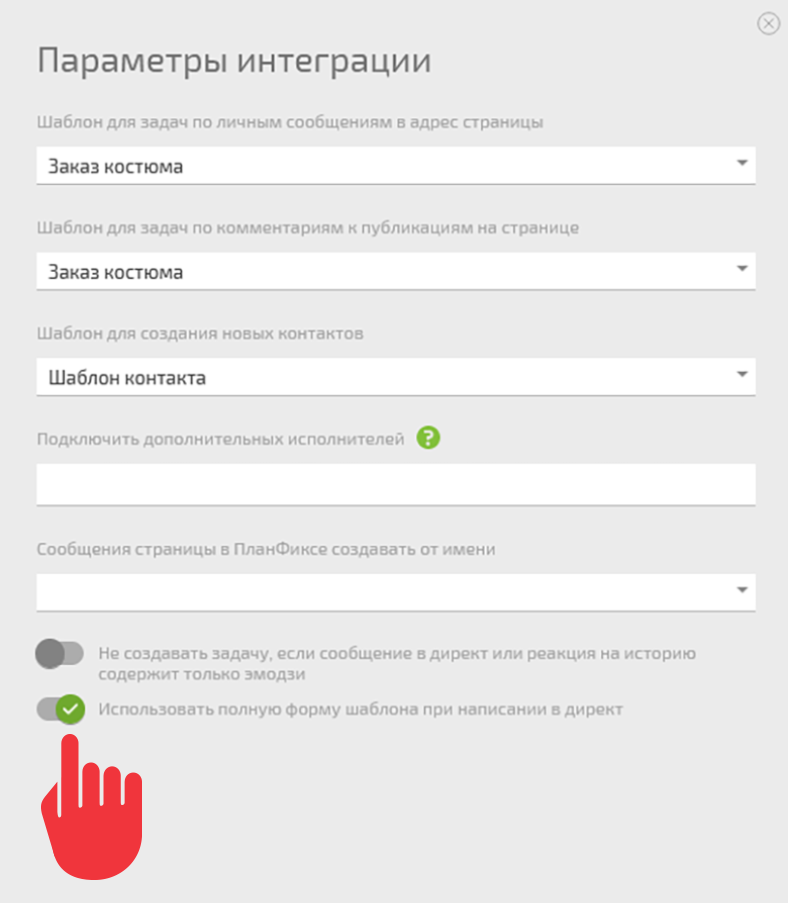

(перенаправлено с «[Instagram](index.php.md "Instagram")»)

[Интеграция](Интеграции.md "Интеграции") с Instagram позволяет отвечать на комментарии под постами и сообщения в директ от контактов прямо из ПланФикса. 

## Возможности

  * Получение и обработка обращений клиентов из Instagram в ПланФиксе.

  * Сбор базы потенциальных клиентов.

  * Командная работа над обращением клиента.

## Опции интеграции

Настройка опций появится после подключения интеграции к ПланФиксу: 

  * Не создавать задачу, если комментарий содержит только эмодзи.

  * Не создавать задачу, если сообщение в директ или реакция на историю содержит только эмодзи.

  * Создавать задачи по отметкам в сторис.

  * Использовать полную форму шаблона при написании в директ.

## Подключение интеграции

**Убедитесь, что у вас есть бизнес-страница Instagram, привязанная к верифицированной странице в Facebook.**

Для настройки интеграции переходим в Управление аккаунтом — Интеграции — Социальные сети — Facebook: 

    

  * Если у вас уже есть страница Facebook, подключенная к ПланФиксу, то достаточно обновить авторизационный токен:

    

  

    

  * Если интеграция ещё не настроена, то добавьте страницу Facebook, вместе с ней автоматически подключится привязанная бизнес-страница Instagram:

    

  

    

  * В параметрах интеграции укажите шаблон для создания контактов и Объекты для задач, созданных по личным сообщениям или комментариям:

    

  

## Как работать с интеграцией

  * Сообщения в Директ

  * Комментарии под публикациями

### Сообщения в Директ

Если пользователь написал вам в Директ — в ПланФиксе будет создана задача с его сообщением. Для того, чтобы ответить, нажмите стрелку под сообщением клиента или уведомьте его при отправке ответа: 

  

    **Важно**

  * Ответить на сообщение клиента можно в течении 24 часов.

  * Если контакт удалил сообщение в директе, оно автоматически удалится и в ПланФиксе. В комментарии будет отображаться следующая надпись: «Сообщение удалено пользователем Instagram».

### Комментарии под публикациями

Если клиент оставил комментарий под вашей публикацией, в ПланФиксе автоматически создастся задача. В ней вы сможете увидеть, под какой именно публикацией оставлен комментарий, и выбрать, как ответить клиенту: 

  * Ответить комментарием под публикацией.

  * Ответить в Директ.

  

**Важно**

  * Ответить на комментарий клиента через Директ можно в течение 7 дней с момента его написания.

  * Может возникнуть ошибка отправки, если профиль контакта в Instagram закрыт.

## Возможные проблемы

  * Если после настройки интеграции сообщения из Директ или комментарии под публикациями не приходят в ПланФикс, откройте Facebook Business Suite и разрешите доступ к сообщениям или комментариям из Instagram в разделе «Входящие»:

    

  

  * Еcли вы ранее подключали Facebook или Instagram, и видите такое окно, то нажмите «Изменить настройки» и выберите нужные страницы Facebook или Instagram.

    

  

  * Если интеграция настроена, но сообщения из Instagram не приходят, нужно активировать переключатель связанных инструментов в настройках управления сообщениями Instagram:

    

  

  * Если при попытке отправить ответ в Директ на комментарий под публикацией возникает ошибка, это может быть связано с тем, что страница не привязана к аккаунту Instagram или привязанный аккаунт Instagram не является профессиональным. Для решения проблемы [ознакомьтесь с инструкцией](https://www.facebook.com/business/help/567938347644871) по подключению Instagram к бизнес-портфолио в Meta Business Suite.

## Правила для ответа на сообщения в Директ

  * **Отправка изображений**. Отправляемое фото может быть высотой/шириной от 256 пикселей до 6144 пикселей. Размер фото не более 8 МБ.

  * **Ограничение по символам**. Ответ из ПланФикса может быть длиной до 1000 символов.

  * **Рассылка**. В ПланФиксе сообщения считаются массовой рассылкой, если за 5 минут отправляется более 3 однотипных сообщений. Такие сообщения хранятся в базе ПланФикса месяц и добавляются в задачу только после ответа клиента. Это позволяет снизить нагрузку на сервера ПланФикса и не засорять хронику участников задачи.

  * **Форма шаблона ответа**. Для корректного приема заказов активируйте в ПланФиксе опцию «Использовать полную форму шаблона при написании в Директ», чтобы видеть и заполнять дополнительные поля. Для обычного общения можно оставить опцию неактивной.

## Правила для ответа на комментарии под публикациями

  * **Ограничение по символам**. Ответ из ПланФикса на комментарий под постом в Instagram может быть до 265 символов.

  * **Работа с типовыми вопросами**. В переписке с клиентами для ответа можно использовать механизм [быстрых ответов](Быстрые_ответы.md "Быстрые ответы").

## Использовать полную форму шаблона при написании в директ

Опция включается в настройках интеграции: 

  

В зависимости от ваших целей можно использовать краткую или полную форму ответа в директ: 

  * Для обычного общения с клиентами используйте краткую форму шаблона — опция в настройках неактивна.

  * Для приёма заказов лучше воспользоваться полной формой шаблона, так как в заказе обычно есть дополнительные поля, которые вы сможете видеть и заполнять — опция в настройках активна.

## Технические ограничения

  * IGTV и Reels в Instagram в настоящее время не поддерживаются интеграцией.

  * Официальный API Instagram не позволяет пересылать сообщения в Директ, а также не обрабатывать звонки по интеграции, поэтому рекомендуем отключить звонки по [инструкции](https://help.instagram.com/1754230088373607)].

## Дополнительно

  * **Информация о диалогах внутри Instagram** — можно ознакомиться в [справке Facebook](https://www.facebook.com/help/instagram/475931443650619).

  * **Доступные интеграции**. Ознакомьтесь с [перечнем сервисов](Интеграции.md "Интеграции") в справке.

  * **Сторонние сервисы для подключения** — до появления официальной интеграции ПланФикса и Instagram взаимодействие осуществлялось через сторонние сервисы: 

    * [ i2crm](Интеграция_ПланФикса_и_Instagram_через_i2crm.md "Интеграция ПланФикса и Instagram через i2crm")

    * [Wazzup](Wazzup.md "Wazzup")

## Обратите внимание

Instagram по API поддерживает не весь контент. Если в direct или комментариях добавлено то, что не поддерживается официальным API на данный момент, тогда вместо содержимого в ПланФикс будут поступать пустые данные с признаком, что контент на текущий момент не поддерживается. Когда ПланФикс получает такой ответ, в задачу автоматически добавляется комментарий с текстом: **Контент не поддерживается официальным API Instagram**. 

На текущий момент официальный API не поддерживает: 

  * Галереи фото отправленные в direct.

  * Пересылку в direct Reels.

  * Пересылку в direct истории.

## Полезно

  * [Блог: Официальная интеграция с Instagram](https://planfix.com/ru/blog/oficialnaya-integraciya-s-instagram/)

  * В переписке с клиентами для ответа на типовые вопросы вы можете использовать механизм [быстрых ответов](Быстрые_ответы.md "Быстрые ответы").

## Важно

Для работы с массовыми рассылками из ВКонтакте, Instagram и WhatsApp в ПланФиксе действует специальный механизм. Пока он работает следующим образом: если в течение 5 минут система обнаруживает больше 3 однотипных исходящих сообщений — они считаются массовой рассылкой. 

Такие сообщения сохраняются в базу ПланФикса, но в задачи не добавляются, пока на такое сообщение не будет получен ответ клиента. Когда ответ поступит, ПланФикс проверит наличие сообщения в базе и, если оно найдено, добавит сообщение в задачу вместе с ответом клиента. 

Обратите внимание, в базе ПланФикса сообщения с признаком массовой рассылки хранятся один месяц. 

Такой механизм реализован, чтобы хроника уведомлений участников задачи меньше захламлялась ненужными сообщениями и не создавала лишнюю нагрузку на сервера ПланФикса. Такая нагрузка может сильно задерживать обработку других сообщений.
