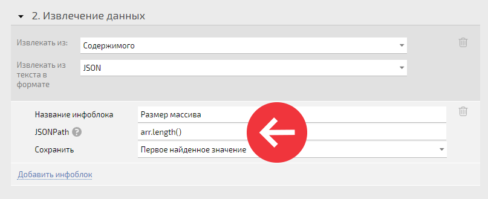
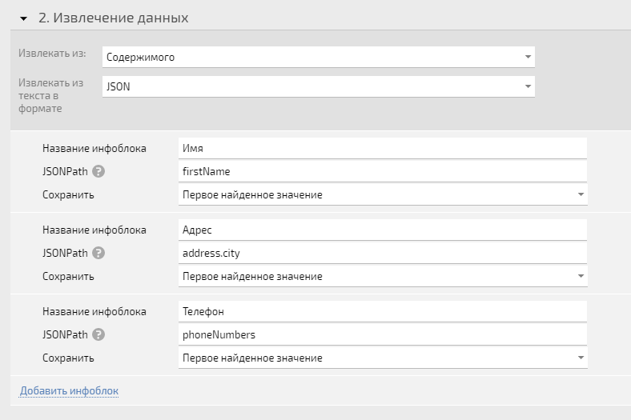
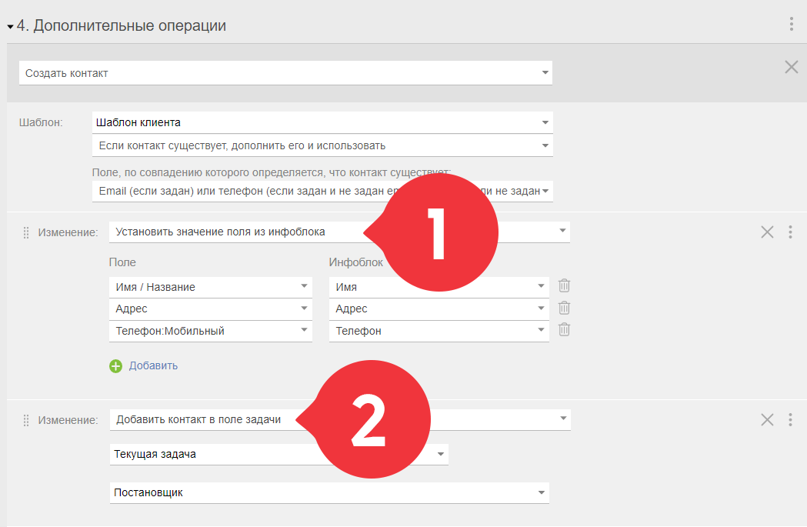
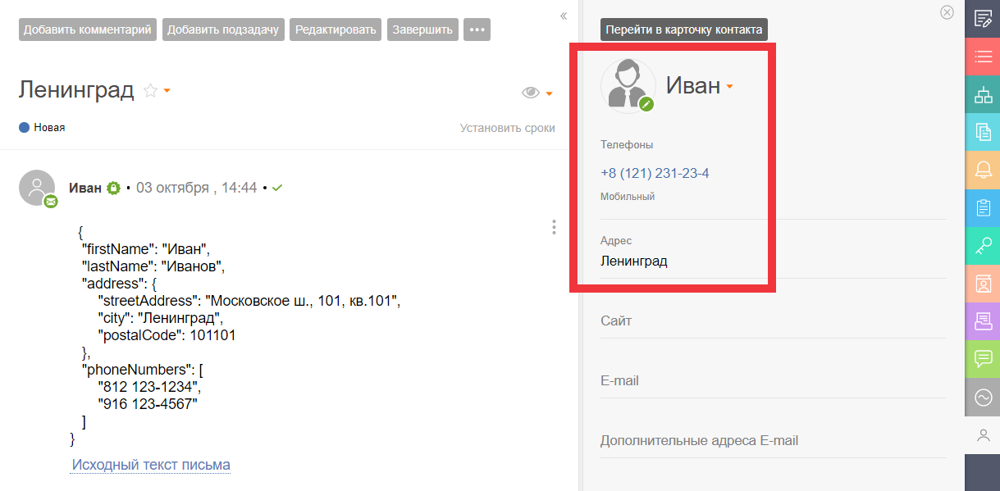
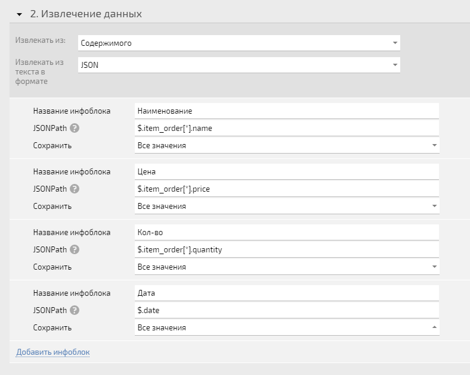
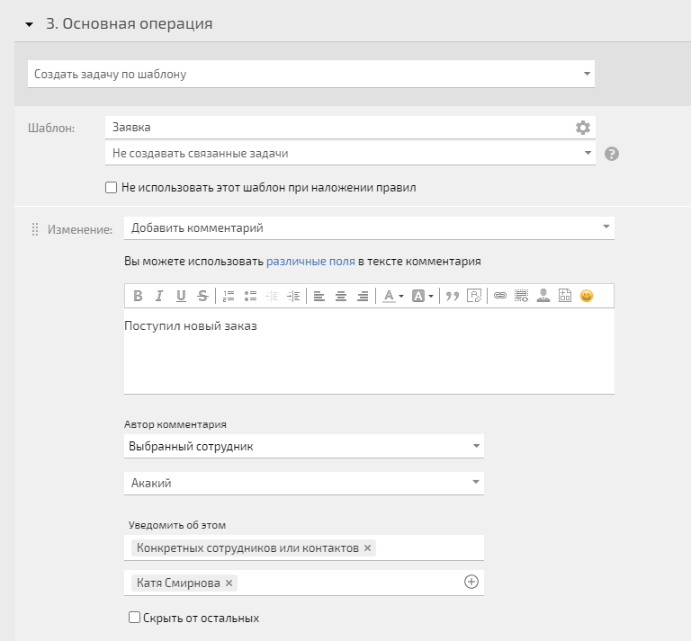
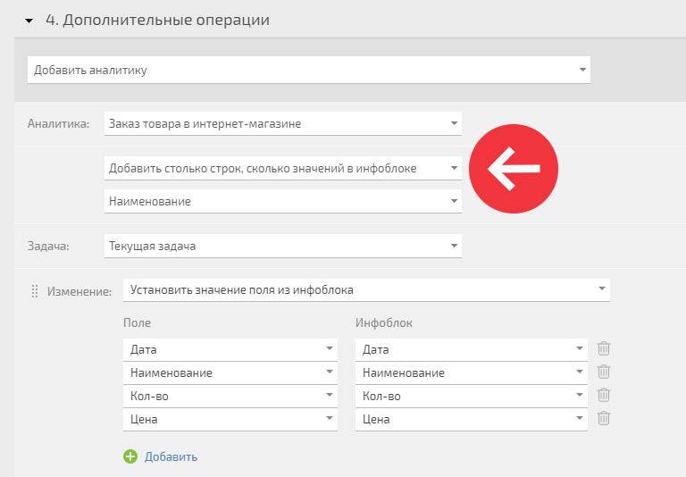
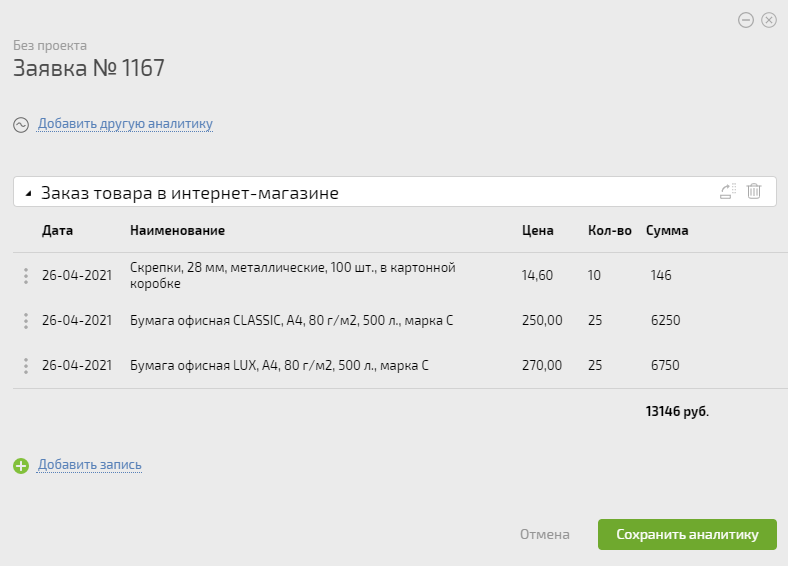

Для отладки и устранения ошибок парсинга используйте специальный онлайн сервис: [JSONPath Online Evaluator](https://jsonpath.com/)

  

Приходящие в ПланФикс [ письма по E-mail](Правило_для_почты__Извлечение_данных.md "Правило для почты: Извлечение данных") или [вебхуки](Входящие_вебхуки.md "Входящие вебхуки") можно разбирать, используя **JSON**. JavaScript Object Notation — это формат для хранения и обмена информацией, доступной для чтения человеком. Есть два основных элемента объекта JSON: ключи и значения. 

Пример: 

    

    

    {"city":"New York", "country":"United States"}

    

  * ключи — city и country;

  * значения — New York и United States.

ПланФикс умеет разбирать письма в таком формате и добавлять нужные данные в инфоблоки. Для этого используется библиотека [JsonPath](https://github.com/json-path/JsonPath). 

Обратите внимание, если при разборе вы используете функцию, необходимо указывать круглые скобки в конце, иначе функция работать не будет: 

  

## Пример № 1

### Передаём в ПланФикс E-mail с текстом в формате JSON

  * Для примера будем использовать такой JSON:

{ 

"firstName": "Иван",  

"lastName": "Иванов", 

"address": {

"streetAddress": "Московское ш., 101, кв.101",  

"city": "Ленинград",  

"postalCode": 101101  

},

"phoneNumbers": [

"812 123-1234",  

"916 123-4567"

]

}

  

  * Например, из JSON нам необходимы следующие данные:

{ 

"firstName": "Иван",  

"lastName": "Иванов", 

"address": {

"streetAddress": "Московское ш., 101, кв.101",  

"city": "Ленинград",  

"postalCode": 101101  

},

"phoneNumbers": [

"812 123-1234",  

"916 123-4567"

]

}

  

  * Настраиваем такое правило для разбора почты:

  

  * Далее создаём нового клиента по шаблону, указываем какие значения полей из каких инфоблоков устанавливать и добавляем контакт в созданную из письма задачу:

  

  * В итоге необходимые данные из письма в формате JSON переданы в ПланФикс:

  

## Пример № 2

### Добавляем параметры JSON в аналитику ПланФикса

  * Для примера будем использовать JSON заказа товаров в интернет-магазине. Данные, которые нужны для добавления аналитики отмечены красным цветом:

{  

"site": "mysite.shop",  

"name": "Елизавета Бояринцева",  

"id": "6598634",  

"date": "26.04.2021 09:16:05",  

"status": "В работе",  

"email": "liz82@gmail.com",  

"phone": "+7 921 625-30-24",  

"address": "Павла Усова 23, корпус 1",  

"price_total": "13146.00",  

"item_order": [ 

{

"sku": "598623",  

"name": "Скрепки, 28 мм, металлические, 100 шт., в картонной коробке",  

"barcode": "596325689126",  

"price": "14.60",  

"quantity": 10 

},  

{ 

"sku": "589624",  

"name": "Бумага офисная CLASSIC, А4, 80 г/м2, 500 л., марка С",  

"barcode": "5963256858963",  

"price": "250.00",  

"quantity": 25 

},  

{ 

"sku": "579824",  

"name": "Бумага офисная LUX, А4, 80 г/м2, 500 л., марка С",  

"barcode": "5963256889634",  

"price": "270.00",  

"quantity": 25 

}  

]

}  

  

  * Настраиваем отдельное правило для задач по почте. Разбираем JSON:

  

  * Создаем новую задачу и оповещаем нужного сотрудника о её появлении:

  

  * Добавляем в созданную задачу аналитику. Обратите внимание, в этом пункте важно указать параметр **Добавить столько строк, сколько значений в инфоблоке** , чтобы в аналитику добавились все значения:

  

  * В итоге в задаче видим оповещение и аналитику:

