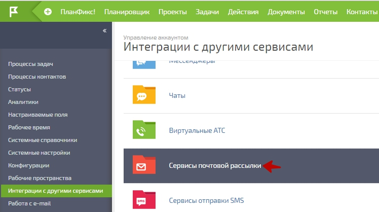
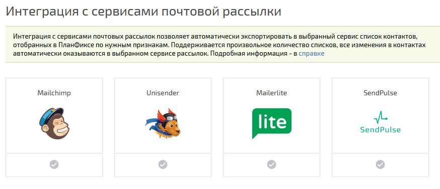

Для включения интеграции с сервисом почтовых рассылок [MailerLite](https://www.mailerlite.com/ru/), перейдите в **Управление аккаунтом / Интеграции / Интеграции с сервисами почтовых рассылок** : 

  

  * В появившемся списке нажмите галочку активации в блоке MailerLite:

  

В появившемся окне потребуется подтвердить включение интеграции, войдя в свой аккаунт MailerLite. 

После этого в каждом [ фильтре контактов](Фильтры_контактов.md "Фильтры контактов") появится возможность включать автоматический экспорт отобранных контактов в MailerLite (см. [ справку](Сервисы_рассылки_e-mail.md "Сервисы рассылки e-mail")). 

  

**Важно:** информация в MailerLite обновляется в течение нескольких минут (обычно 7-8). Учтите это при планировании рассылок.
