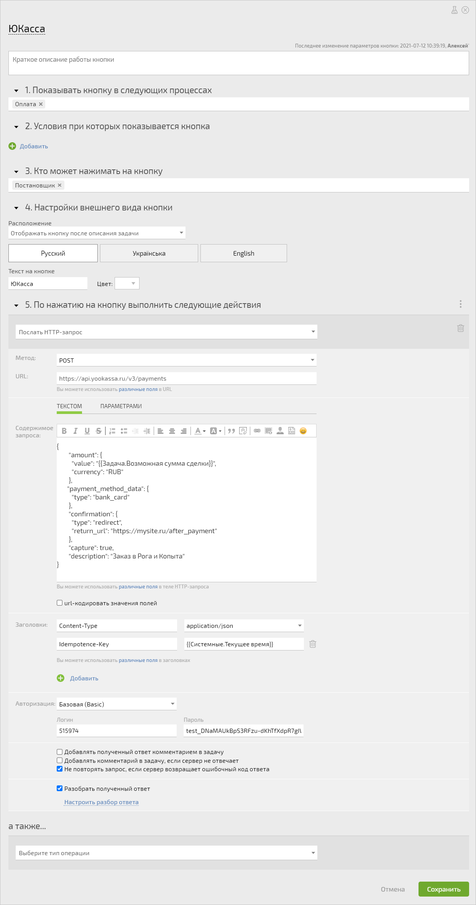
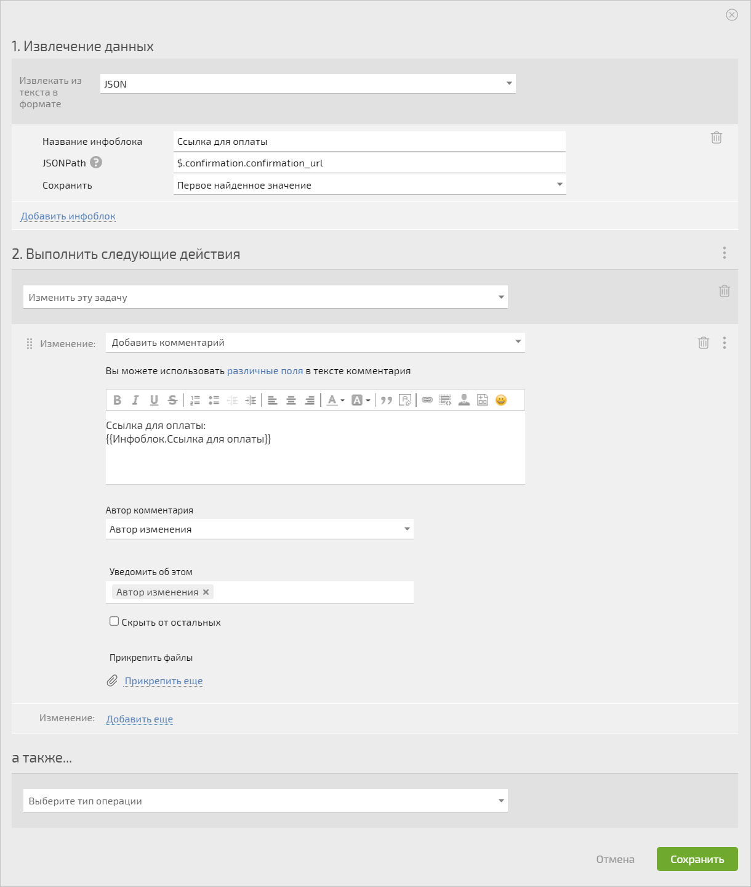

Для общения ПланФикса и ЮКассы будем использовать [автоматический сценарий](Автоматические_сценарии.md "Автоматические сценарии") c [HTTP-запросом](HTTP-запросы.md "HTTP-запросы"). Пример, который настроим, позволит автоматически формировать ссылку на оплату и отправлять её клиенту. 

  * **Шаг № 1** — формируем запрос с платежной информацией для ЮКассы и проходим базовую авторизацию:

    

    

    {

            "amount": {

              "value": "{{Задача.Возможная сумма сделки}}",

              "currency": "RUB"

            },

    

           "payment_method_data": {

              "type": "bank_card"

            },

    

            "confirmation": {

              "type": "redirect",

              "return_url": "https://mysite.ru/after_payment"

            },

            "capture": true,

            "description": "Заказ в Рога и Копыта"

    }

    

  

  * **Шаг № 2** — разбираем полученный ответ и добавляем ссылку на оплату в задачу:

  

## Дополнительная информация

  * [Пост про POST](https://planfix.com/ru/blog/post/)

  * [Разбор ответов на HTTP-запросы](https://planfix.com/ru/blog/razbor-otvetov-na-http-zaprosy/)
