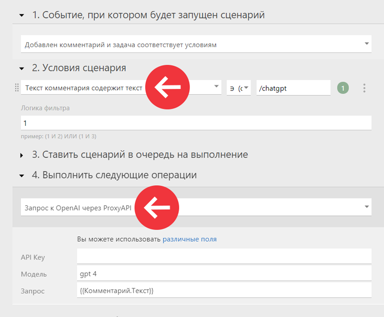

Запросы к OpenAI из ПланФикса можно осуществлять через сервис [proxyAPI](https://proxyapi.ru/). 

## Настройка

Для работы интеграции сделайте следующее: 

  * Зарегистрируйтесь в [proxyAPI](https://proxyapi.ru/).

  * Пополните счет в разделе [Биллинг](https://console.proxyapi.ru/billing). Оплатить можно рублями РФ.

  * Получите [API Key](https://console.proxyapi.ru/keys). Используйте его для отправки запросов к OpenAI.

  * Установите конфигурацию ProxyAPI из [маркетплейса ПланФикса](https://planfix.ru/configurations/zapros-k-openai-cherez-proxyapi-p160/). Она добавит в ваш аккаунт пользовательскую операцию сценариев — «Запрос к OpenAI через ProxyAPI».

  

Пример сценария с пользовательской операцией «Запрос к OpenAI через ProxyAPI»: 

Список возможных моделей есть в документации OpenAI: <https://platform.openai.com/docs/models>
