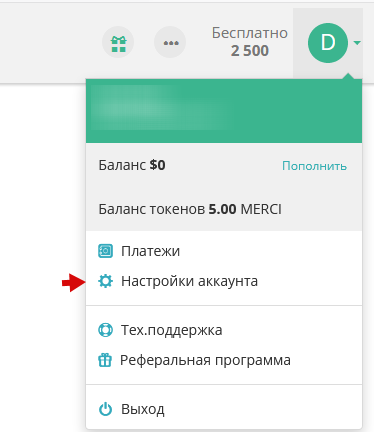
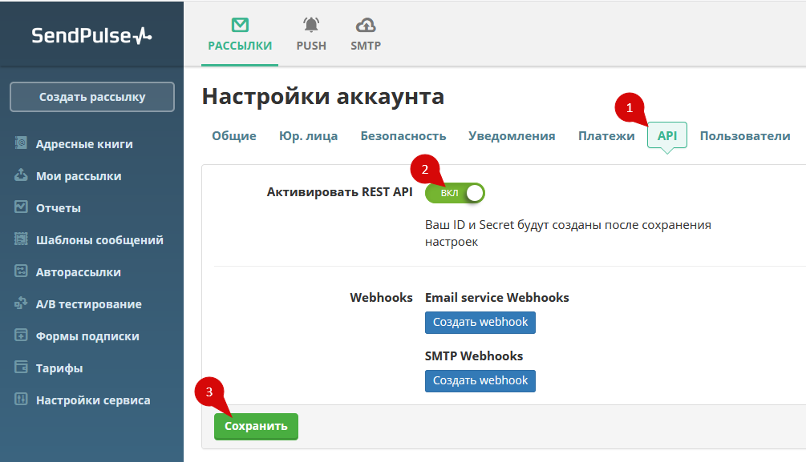
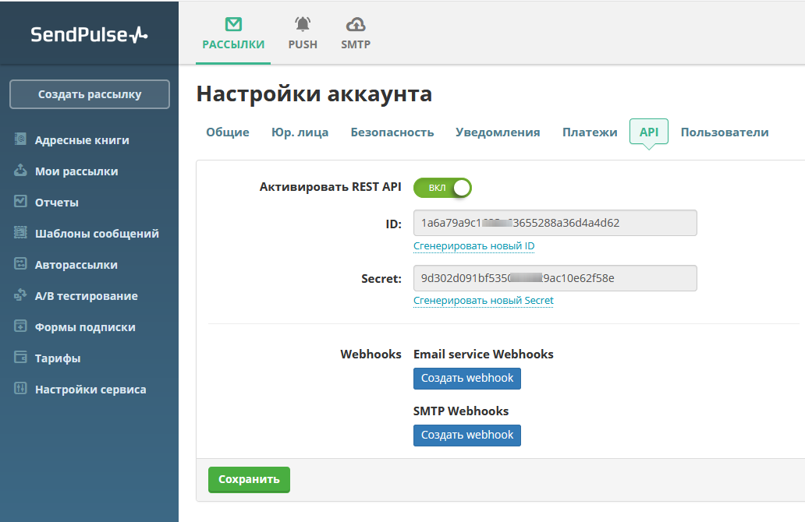
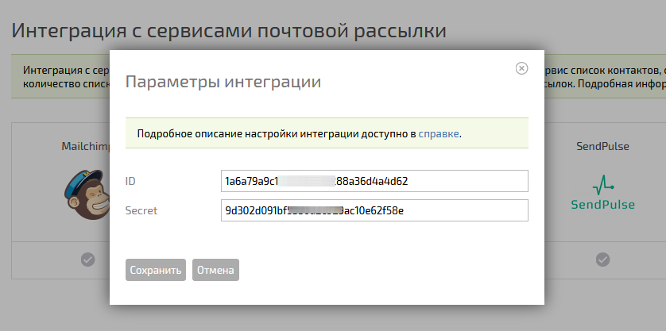

Для включения интеграции с сервисом почтовых рассылок [SendPulse](https://sendpulse.com/), перейдите в 

**Управление аккаунтом / Интеграции / Интеграции с сервисами почтовых рассылок** : 

  

  * В появившемся списке нажмите галочку активации в блоке SendPulse:

  

  * Откройте в соседней вкладке [SendPulse](https://login.sendpulse.com/) и войдите в него под своей учетной записью. Откройте настройки аккаунта:

  

  * Перейдите на вкладку **API** (1), активируйте **REST API** (2) и **сохраните** изменения (3):

  

  * На экране отобразятся параметры **ID** и **Secret** :

  

  * Перейдите на страницу интеграции с SendPulse в ПланФиксе и вставьте их в соответствующие поля:

  

Сохраните изменения. После этого в каждом [ фильтре контактов](Фильтры_контактов.md "Фильтры контактов") появится возможность включать автоматический экспорт отобранных контактов в SendPulse (см. [ справку](Сервисы_рассылки_e-mail.md "Сервисы рассылки e-mail")).
