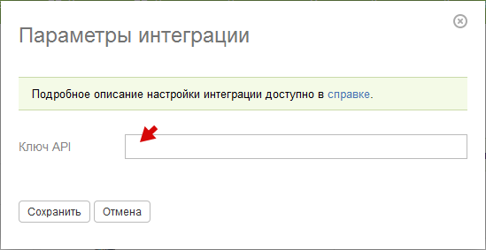

Для включения интеграции с сервисом почтовых рассылок [Unisender](https://www.unisender.com/), перейдите в 

**Управление аккаунтом / Интеграции / Интеграции с сервисами почтовых рассылок** : 

  

  * В появившемся списке нажмите галочку активации в блоке Unisender:

  

  * Откройте в соседней вкладке свой **личный кабинет Unisender** и перейдите на вкладку **Интеграция и API** (1).

  * **Включите API** (2) и скопируйте **Ключ доступа к API** (3):

  

**Важно:** обязательно включите API, иначе интеграция не будет работать. 

  

  * Затем перейдите на страницу интеграции с Unisender в ПланФиксе и вставьте ключ в соответствующее поле:

После этого в каждом [ фильтре контактов](Фильтры_контактов.md "Фильтры контактов") появится возможность включать автоматический экспорт отобранных контактов в Unisender (см. [ справку](Сервисы_рассылки_e-mail.md "Сервисы рассылки e-mail")).
