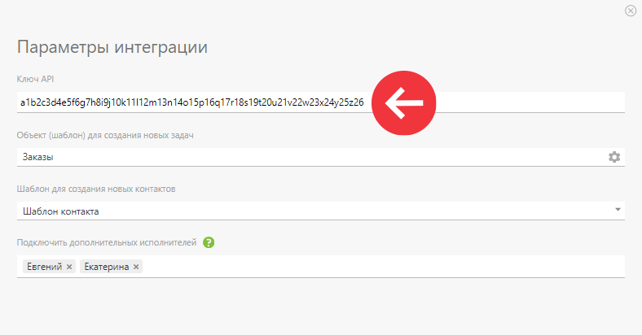
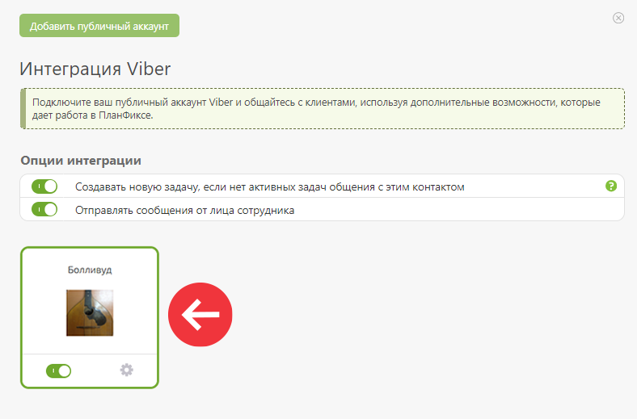
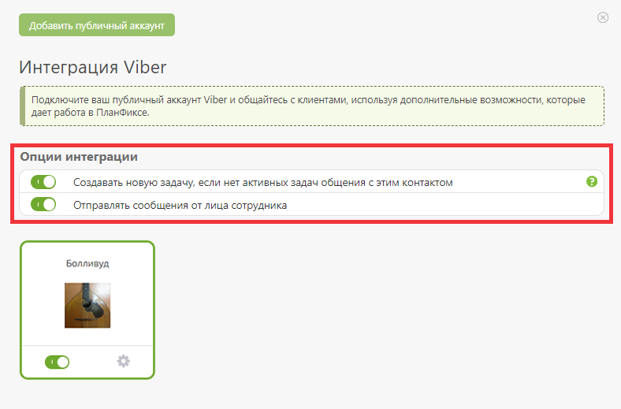
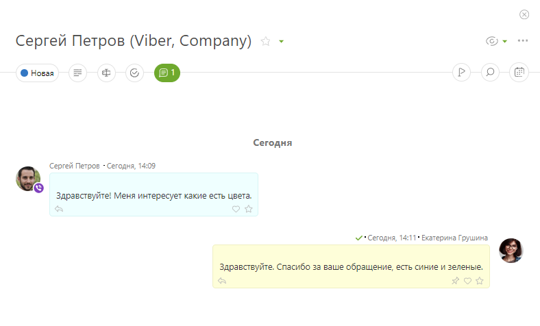

Вы можете [подключить](Интеграции.md "Интеграции") к ПланФиксу чат-ботов Viber для приема и обработки сообщений клиентов. 

Обратите внимание, с 5 февраля 2024 Viber обновил [условия создания чат-ботов](https://help.viber.com/hc/en-us/articles/15247629658525-Bot-Commercial-Model) — теперь это платная функция. Если ваш чат-бот создан ранее этой даты, то он будет работать на старых условиях. 

## Возможности

  * Удобная обработка обращений клиентов из Viber в едином интерфейсе ПланФикса.

  * Автоматическое сохранение контактов клиентов.

  * Доступны [быстрые ответы](Быстрые_ответы.md "Быстрые ответы"), для ответа на часто задаваемые вопросы клиентов.

## Как создать чат-бота в Viber

  1. Заполните [заявку на создание бота](https://share.hsforms.com/12pxGHMtAS3yq_3KcxQ6g1A4fpwx) в Viber.

  2. Команда Viber свяжется с вами для обсуждения дальнейших шагов.

  3. Когда заявку одобрят, вы получите ключ API, необходимый для подключения интеграции в ПланФиксе.

## Как заполнить заявку

Перейдите на сайт Viber и заполните форму на английском. 

  1. Are you familiar with new Chatbot Commercial Terms? — Вы ознакомились с коммерческими условиями подключения чат-бота? Выберите: Да/Нет

  2. First name — Имя

  3. Last name — Фамилия

  4. Work email — Рабочая электронная почта

  5. Country — Страна

  6. Company name — Название компании

  7. Company website — Сайт компании

  8. Do you have a Viber Business Account? — У вас есть бизнес аккаунт Viber? Выберите: Да/Нет

  9. Company type — тип компании: 

     1. Владелец чат-бота

     2. Разработчик чат-бота

     3. Занимаетесь перепродажей чат-ботов

     4. Другое

  10. Your inquiry — ваш запрос. Напишите, что вы хотите подключить чат-бота.

По всем вопросам можно [обратиться в поддержку Viber](https://help.viber.com/hc/en-us/requests/new?ticket_form_id=5377663333917). 

## Как подключить чат-бота к ПланФиксу

  * В ПланФиксе переходим в раздел Управление аккаунтом — Интеграции — Мессенджеры.

  * Открываем Viber и добавляем публичный аккаунт. В появившемся окне вставляем ключ API, который отправила команда Viber:

  

В этом же окне: 

  * Выберите шаблоны, по которым будут создаваться контакты или задачи.

  * Укажите, кого [дополнительно подключать к общению в качестве исполнителей](Дополнительное_подключение_сотрудников.md "Дополнительное подключение сотрудников").

После добавления ключа ваш аккаунт будет подключен в ПланФикс: 

## Дополнительные настройки

Помимо основных настроек интеграции, есть следующие дополнительные опции: 

  

  * **Создание новой задачи, если нет активных задач общения с этим клиентом**. При активации этой опции новая задача будет создаваться, если предыдущая задача клиента удалена, завершена или находится в неактивном статусе. При этом ссылка на предыдущую задачу автоматически добавляется в описание новой.

  * **Отправка сообщения от лица сотрудника**. При использовании опции клиент будет получать уведомления персонально от лица сотрудника, написавшего его в ПланФиксе.

## Работа интеграции

Для того, чтобы написать вашему бот-аккаунту Viber пользователь должен перейти по специальной ссылке, где вместо {botname} будет имя вашего бота: 

    

    

    viber://pa?chatURI={botname}

  

Вот так, например, выглядит ссылка на бот нашей службы поддержки: 

    

    

    viber://pa?chatURI=planfix

  

  * Когда пользователь Viber впервые напишет личное сообщение, в ПланФиксе будет создана новая задача, в которой клиент станет постановщиком.

  * Исполнителем становится сотрудник, указанный в шаблоне задач интеграции.

  * Если исполнителем не указан никто, система назначит им управляющего аккаунтом или сотрудника, который настраивал интеграцию:

  

  * Каждое последующее сообщение от пользователя будет добавляться в его задачу.

  * Ваши ответы в ПланФиксе будут отправлены ему в Viber вместе с текстом сообщения и приложенными файлами, если вы укажете пользователя в блоке «Уведомить об этом».

## Ограничения

  * Публичные чаты в Viber не поддерживаются.

  * Номер телефона клиента можно узнать, только если он сам его укажет в диалоге.
