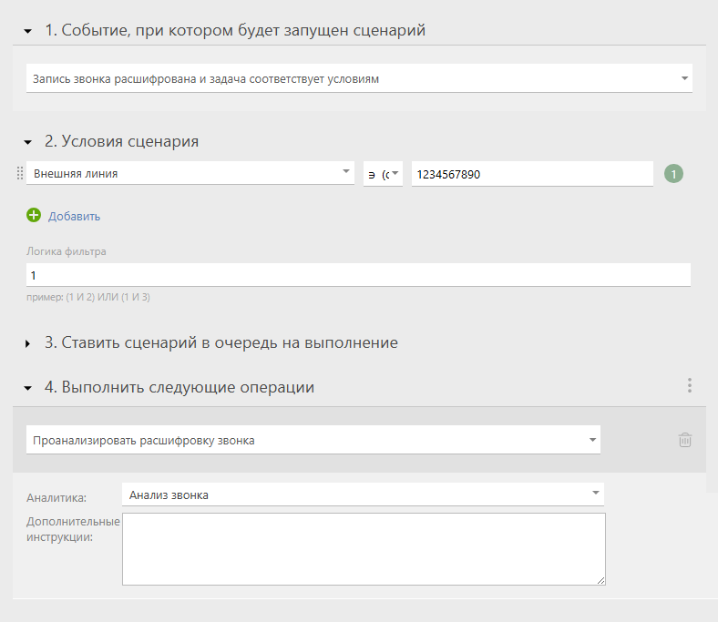

При включении этой опции Planfix AI не только [автоматически расшифрует](Распознавание_речи.md "Распознавание речи") звонок, но и проанализирует его содержание, выделив ключевые моменты. Это помогает быстро оценить результат звонка без прослушивания записи. 

## Пример использования

Компания обзванивает клиентов с новым предложением. Менеджеры общаются по скрипту. 

Planfix AI: 

  * определяет, был ли разговор удачным;

  * фиксирует, что клиент интересуется доставкой;

  * находит, что клиент упомянул конкурента;

  * создаёт аналитику с этими данными и отчёт.

## Где настроить

  * Перейдите в "Управление аккаунтом" — "Planfix AI" — "Распознавание речи".

  * Активируйте опцию "Автоматически распознавать записи звонков".

  * Затем активируйте опцию "Автоматически анализировать записи звонков".

  * После чего автоматически создастся системная аналитика «Анализ звонка» и соответствующий отчет.

  * Функционал пока поддерживает такие типы полей: "Строка", "Текст", "Набор значений".

## Аналитика звонка

После анализа звонка Planfix AI автоматически добавляет в аналитику по умолчанию: 

  * Дату анализа

  * Сотрудника

  * Контакта

  * Тему звонка

  * Ключевые слова

  * Общий настрой диалога

  * Статус (итог) звонка

  * Наличие инцидентов или критических моментов

  * Рекомендованные дальнейшие шаги

В аналитику звонка можно добавить свои поля. 

## Как это работает

Вы можете использовать анализ звонков на трёх уровнях. 

Базовый   

---  

Ничего не настраиваете — Planfix AI сам заполняет системную аналитику «Анализ звонка», которая создаётся автоматически при включении опции.   

  

  

С пользовательскими полями   

---  

Добавьте в аналитику свои поля (пока поддерживаются следующие типы полей: "Строка", "Текст", "Набор значений"). Planfix AI попытается заполнить их по смыслу, например: 

  * Поле "Причина отказа" — Рlanfix AI распознает её в разговоре.

  * Поле "Ключевые слова" — запишет часто упоминаемые фразы.

  

  

  

С дополнительными инструкциями   

---  

Заполните поле «Дополнительные инструкции» в настройках — Planfix AI учтёт их при анализе. Можно указать: 

  * какие детали важны,

  * на что обратить внимание,

  * какие поля приоритетны

  * и многое другое.

  

  

## Анализ расшифрованных звонков по условию

Если вам необходима гибкость в анализе звонков, например, анализировать не все звонки или анализировать разные звонки по-разному, для этого используйте [автоматические сценарии](Автоматические_сценарии.md "Автоматические сценарии") c событием "Запись звонка расшифрована и задача соответствует условиям": 

  * задайте в сценарии нужные условия,

  * укажите операцию "Проанализировать расшифровку звонка",

  * добавьте нужную аналитику и дополнительные инструкции к ней:

## Ограничения и особенности

  * Проанализировать расшифрованную запись можно вручную, нажав на соответствующую кнопку в выпадающем меню комментария.

  * Planfix AI анализирует только разговоры, которые были распознаны — опция не работает с чистыми аудиофайлами.

  * Пока в аналитике анализа звонка поддерживаются пользовательские поля следующих типов: "Строка", "Текст", "Набор значений".
