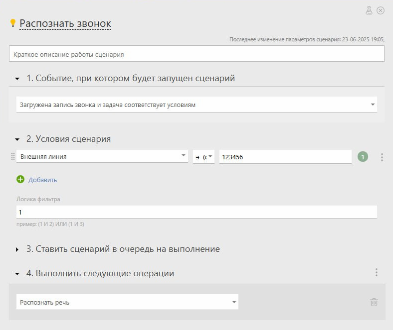

Вы можете использовать Planfix AI для автоматического [распознавания](Распознавание_речи.md "Распознавание речи") аудиозаписей звонков, прикреплённых к задачам, комментариям или контактам. Это позволит сэкономить время на прослушивание и сразу перейти к анализу содержания разговора. 

## Пример использования

Вы добавили запись звонка клиента в задачу. Planfix AI автоматически распознает аудио и создаёт текстовую расшифровку, которую можно использовать для: 

  * технической поддержки: быстрое понимание сути обращения клиента,

  * продаж: анализ потребностей клиента без прослушивания записи.

  * контроля качества: быстрая проверка соблюдения скриптов.

  * быстрого поиска нужной информации по звонку.

## Как это работает

  * В ПланФикс загружается запись звонка.

  * Planfix AI автоматически распознаёт звонок и преобразует его в текст.

  * Распознанный текст добавляется в комментарий к задаче или объект, к которому прикреплён звонок.

ПланФикс запускает автоматическое распознавание, если: 

  * включена соответствующая настройка в аккаунте,

  * формат аудиофайла поддерживается (.mp3, .ogg, .wav, .mp4),

  * аудио-файл не превышает 100 МБ.

## Где настроить

  * Перейдите в "Управление аккаунтом" — "Planfix AI" — "Распознавание речи".

  * Активируйте опцию "Автоматически распознавать записи звонков".

## Ограничения и особенности

  * Распознавание выполняется с некоторой задержкой: 

    * 3-минутное голосовое распознается за 10 сек, прочитается за 90 сек, экономите 1 минуту 20 секунд

    * 10-минутный разговор с клиентом распознается за 30 сек, читается 5 мин, экономите 4 минуты 30 секунд

    * 1,5-часовое интервью с клиентом распознается за 1 минуту, читается 45 минут, экономите 44 минуты.

  * Качество расшифровки зависит от четкости речи, фонового шума и языка.

  * В случае ошибки, текст можно отредактировать вручную.

## Важно

  * Если вам необходимо распознавать не все звонки, а только определенные, используйте автоматический сценарии задач (или контактов, в зависимости от того, где настроено сохранять записи звонков):

