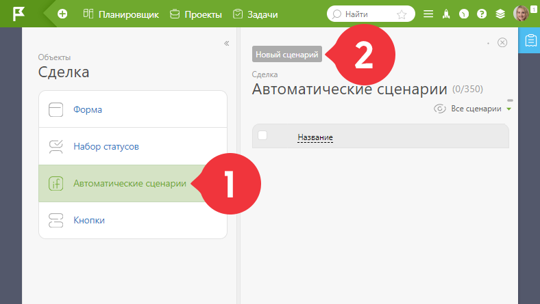
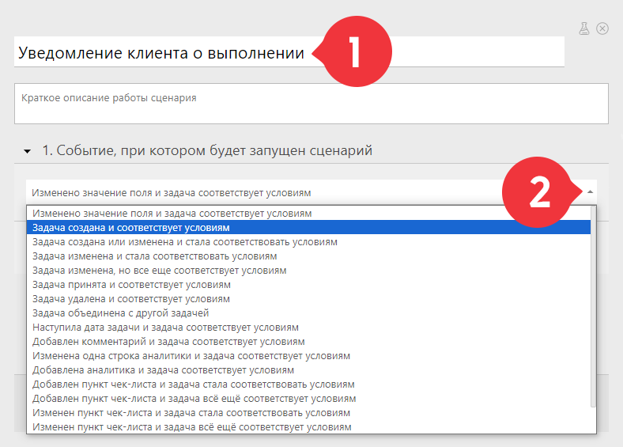
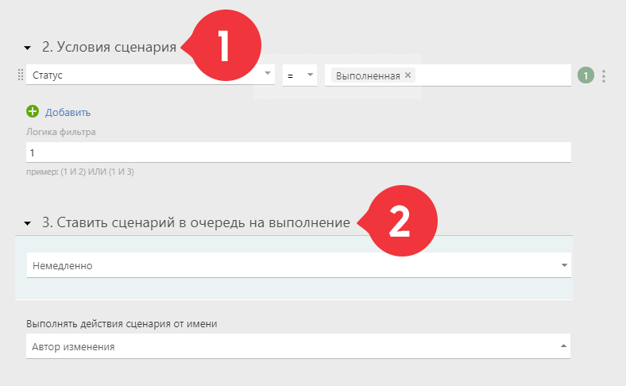
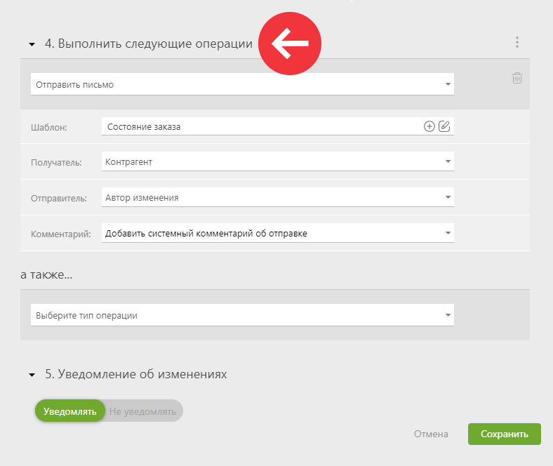

**Автоматические сценарии** — последовательность операций над задачами или контактами, которая выполняется автоматически при определенных событиях и условиях. 

## Создание нового сценария

Изначально список сценариев [Объекта](Объекты.md "Объекты") пуст, можно только добавить новый: 

  

## Настройка сценария

  * Дайте сценарию говорящее название.

  * Выберите событие, при котором он должен сработать:

  

  * Укажите условия для срабатывания сценария.

  * Выберите очередь на выполнение и автора действий:

  

  * Укажите события, которые должны произойти по сценарию, внесите данные в дополнительные поля.

  * Сохраните сценарий:

  

## Важно

  * Вы можете отлаживать автоматические сценарии в [режиме тестирования](Режим_тестирования_сценариев_задач_и_контактов.md "Режим тестирования сценариев задач и контактов").

  * Сценарии доступны для всех тарифов. Количество сценариев, которые могут быть добавлены в рамках одного Объекта, зависит от [тарифа](Какой_пакет_выбрать_.md "Какой пакет выбрать?"), на котором находится ваш аккаунт. В бесплатной версии ПланФикса есть возможность добавить **только один** автоматический сценарий.

  * Если сценарий содержит операцию массового изменения задач (пример: **Изменить другие задачи** — **Задачи в одном проекте с текущей** , **по шаблону**), то такая операция будет применена максимум к 150 задачам, попадающим под условие срабатывания этой операции.

  

## Дополнительно

  * [Автоматические сценарии в ПланФиксе](Автоматические_сценарии.md "Автоматические сценарии")
