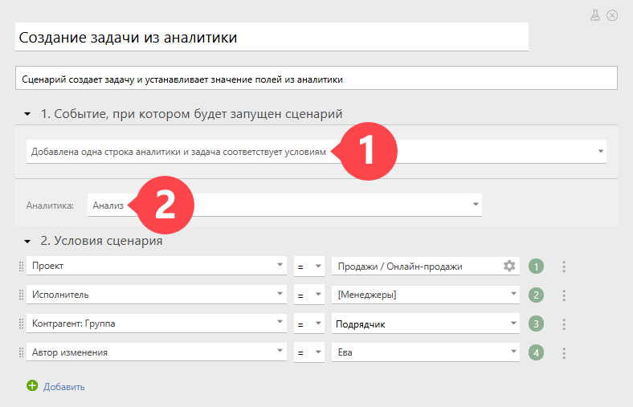
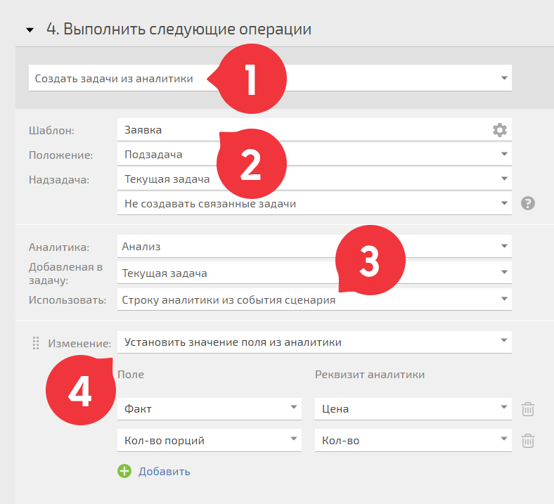

Из добавленных в задачу [аналитик](Аналитика.md "Аналитика") можно автоматически создавать новые задачи или подзадачи. Для этого воспользуйтесь [автоматическим сценарием](Автоматические_сценарии.md "Автоматические сценарии") в [Объекте](Объекты.md "Объекты"): 

  * с событием **Добавлена одна строка аналитики и задача соответствует условиям**

  * и укажите название аналитики, по которой будут создаваться задачи:

  

Далее в настройках сценария выберите операцию **Создать задачи из аналитики** (1). 

  * Укажите (2): 

    * по какому шаблону создавать

    * положение

    * надзадачу (при необходимости)

  * Выберите (3): 

    * аналитику, по которой будет создаваться задача

    * в какую задачу она добавлена

    * в пункте «Использовать» — **Строку аналитики из события сценария** — это значит, что для каждой строки аналитики будет создаваться своя задача

  * Установите нужные значения в поля новой задачи из полей аналитики (4):

