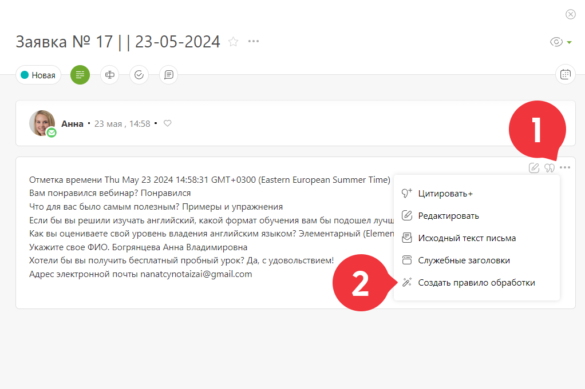
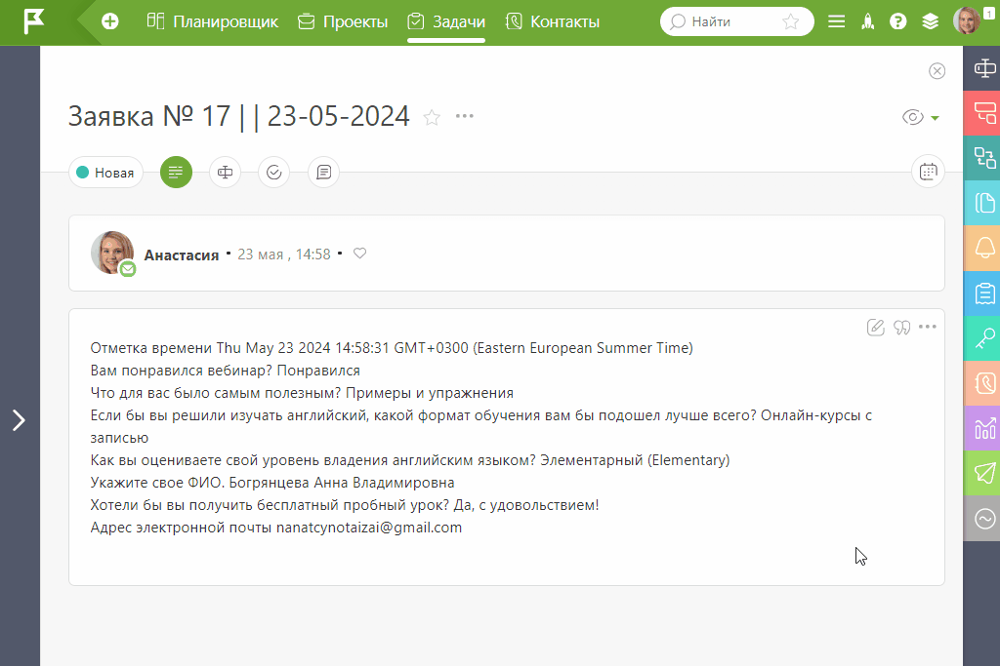
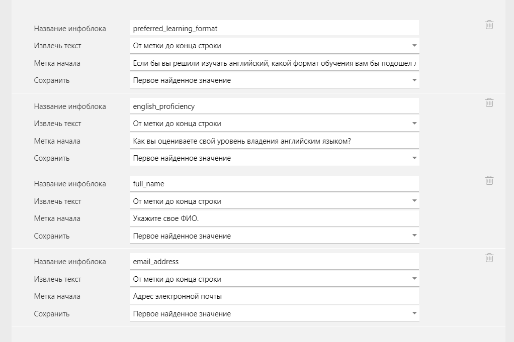
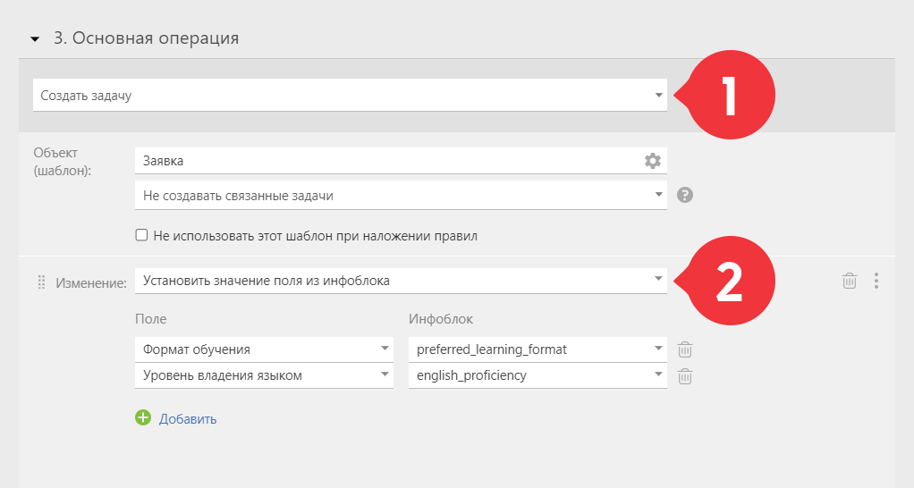

Создать правило для разбора почты можно автоматически с помощью [Planfix AI](Planfix_AI.md "Planfix AI"): 

  * Письма, приходящие на [виртуальные e-mail адреса](Виртуальные_e-mail_адреса.md "Виртуальные e-mail адреса") в ПланФиксе, становятся задачами. Перейдите в описание такой задачи и выберете «Создать правило обработки»:

  

  * AI автоматически проанализирует письмо, разобьёт на инфоблоки всю доступную информацию и создаст правило:

  

  * Вам остаётся отредактировать правило, оставив в нём только нужное:

  

  * Обратите внимание, данные из инфоблоков можно использовать для автоматического заполнения полей задачи:

