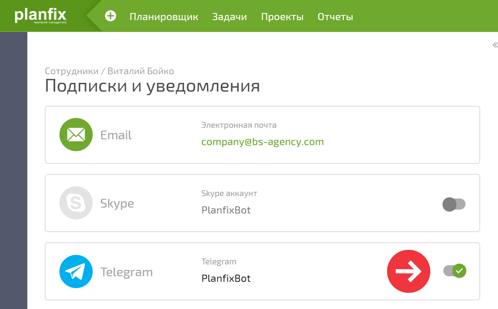
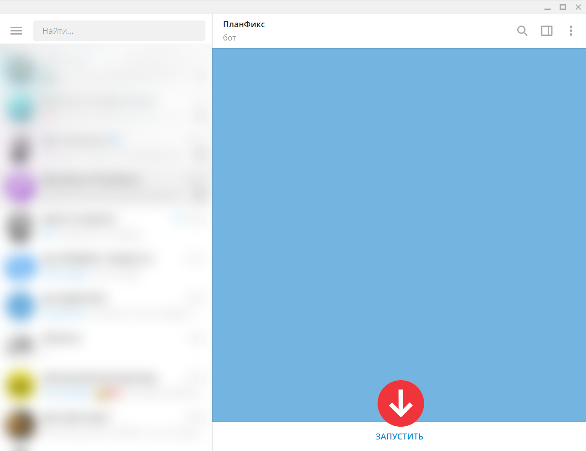
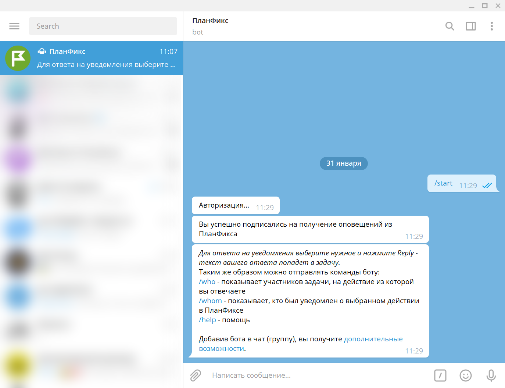

Для того, чтобы получать уведомления из ПланФикса в Telegram, работать с ботом ПланФикса для Telegram или собственными ботами для Telegram, вам понадобится пройти авторизацию. Авторизация производится разово и позволяет связать вашу учетную запись в ПланФиксе с учеткой в Telegram. 

Для прохождения авторизации: 

  * Установите версию [Telegram для десктопа.](https://desktop.telegram.org)

  * Зайдите в свою [карточку пользователя](Страница_пользователя.md "Страница пользователя") ПланФикса и в окошке с Телеграмом переместите слайдер вправо, нажав на него:

  

  * После подтверждения появится стартовое окошко телеграм-бота ПланФикса, в котором нужно нажать Запустить:

  

  

При успешном проведении операции появится надпись: 

  

  

Это означает, что авторизация пройдена и вы можете пользоваться всеми возможностями [ интеграции ПланФикса и Telegram](Telegram.md "Telegram"). 

  

## Важно

**Если авторизация не проходит, убедитесь, что Telegram не заблокирован в вашей стране и корректно работает на вашем устройстве.**
