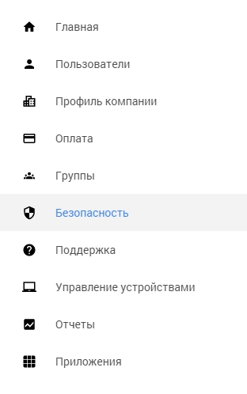
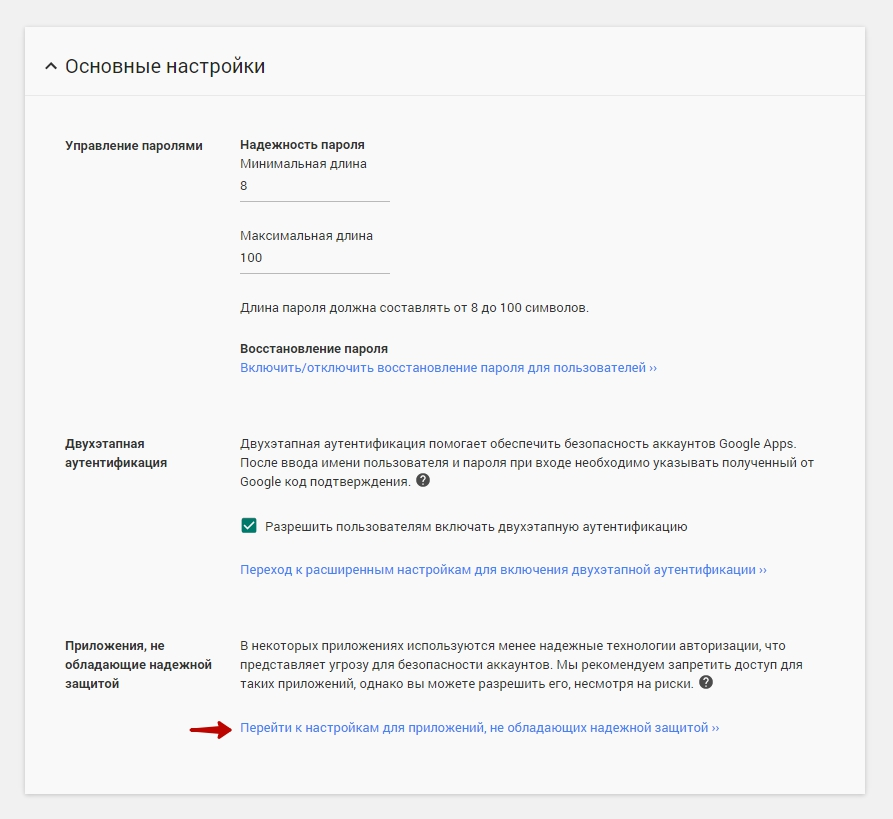
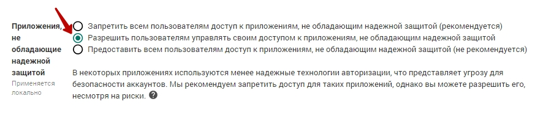

Если вы используете сервис **Google G Suite** и хотите, чтобы ПланФикс отправлял уведомления с вашего Gmail-адреса, потребуется изменить настройку безопасности для приложений: 

  * Зайдите в раздел **Безопасность** :

  

  * В разделе **Основные настройки** перейдите к пункту:

  

  * Установите его на следующее значение:

  * Сохраните настройки.

  

Сервис уведомит вас, что через 24 часа будет обновлена информация о настройках безопасности и вы сможете [ продолжить настройку](Использование_учетных_записей_почты_Google.md "Использование учетных записей почты Google").
