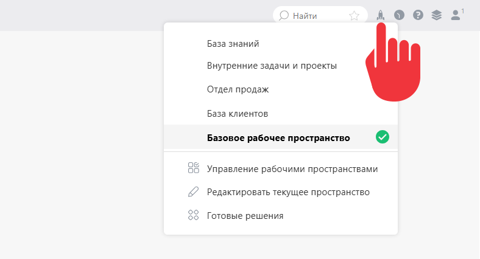

**Базовое рабочее пространство** \- [рабочее пространство](Рабочее_пространство.md "Рабочее пространство") со стандартным набором функционала, которое по умолчанию доступно каждому пользователю системы. 

  * Если у пользователя есть доступ только к базовому рабочему пространству, пункт меню рабочих пространств ("ракета") для него отображаться не будет

  * Если помимо базового, пользователю [ дан доступ](Доступ_к_рабочему_пространству.md "Доступ к рабочему пространству") к другим рабочим пространствам, у него в главном меню отображается пункт переключения между рабочими пространствами и есть возможность переключиться в базовое рабочее пространство:

  

Для переключения необходимо кликнуть на значок ракеты и выбрать нужное рабочее пространство. 

## Важно

  * Базовое рабочее пространство невозможно отредактировать. Если вам необходимо внести изменения в рабочую среду, [ создайте новое рабочее пространство](Создание_рабочего_пространства.md "Создание рабочего пространства") и сделайте все нужные изменения в нем.

  * Справочные материалы по умолчанию оперируют разделами и пунктами меню базового рабочего пространства. Поэтому для облегчения настройки системы мы рекомендуем переключиться в базовое рабочее пространство.
