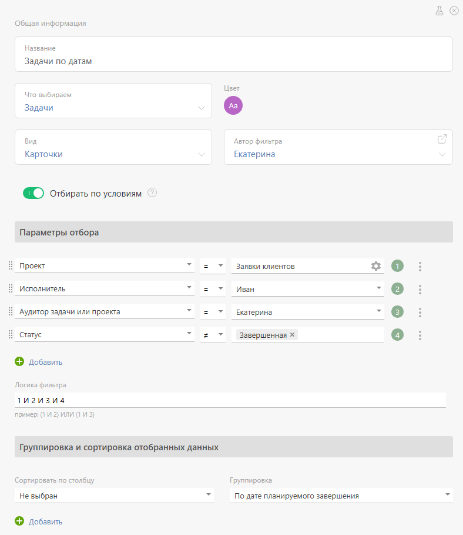
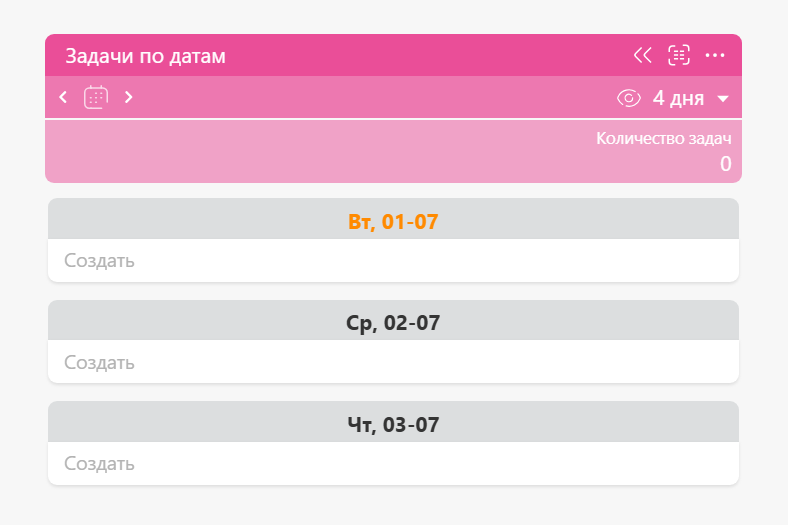
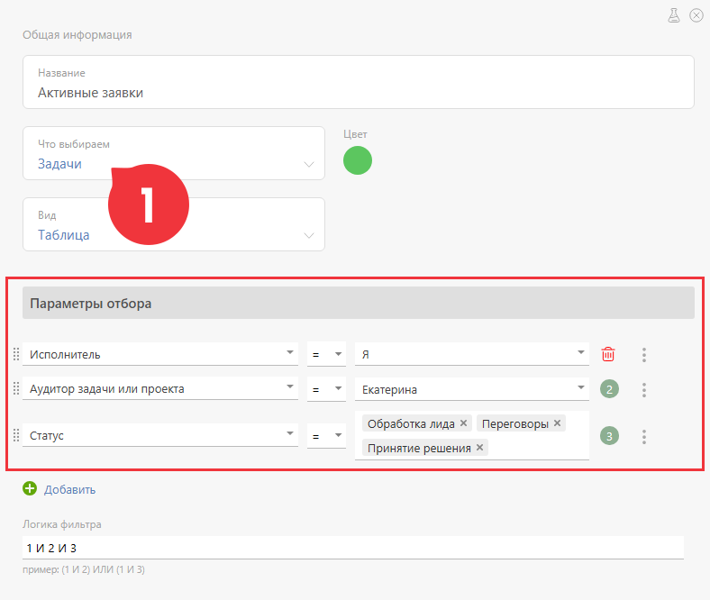
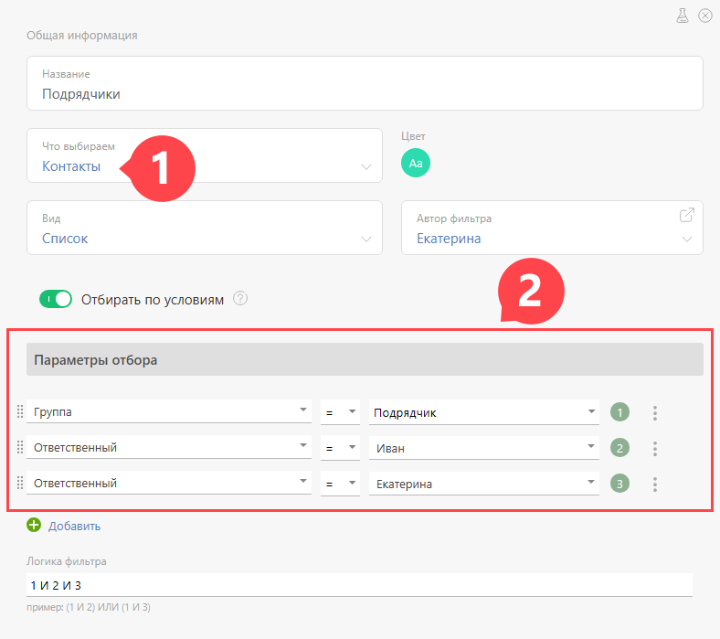

В [ фильтрах задач](Фильтры_задач.md "Фильтры задач") и списках [ Планировщика](Планировщик.md "Планировщик") есть поля, при помощи которых можно быстро создать задачу: 

  

Если в таком поле набрать название и нажать **Enter** , то ПланФикс создаст задачу с таким названием и параметрами, соответствующими параметрам отбора задач в этом столбце. Аналогично для фильтров и списков контактов: будет создан контакт/компания с введенным именем/названием и параметрами, соответствующими параметрам отбора в этот список. 

То, что созданный объект автоматически приобретает свойства, заданные в параметрах фильтра, является важной особенностью создания [ задач](Задачи.md "Задачи") и [ контактов](Контакты.md "Контакты") в фильтрах (в том числе в списках [ Планировщика](Планировщик.md "Планировщик")). Такое поведение позволяет: 

  * созданному объекту сразу появляться в фильтре, так как он соответствует условиям отбора в него;

  * упрощать ввод данных за счет того, что часть параметров задачи или контакта заранее прописана в настройках фильтра - это экономит время пользователя и уменьшает вероятность ошибки.

## Механизм применения параметров фильтра при создании объекта

  * Все параметры отбора, перечисленные в условиях отбора, применяются к созданной задаче или контакту последовательно,в порядке, в котором они указаны в фильтре.

  * Если в списке условий есть несколько типовых - например, **Статус 1 ИЛИ Статус 2** , то применится только одно, последнее условие (в данном примере для задачи установится **Статус 2**).

Такая логика используется для того, чтобы при настройке была возможность в явном виде указывать, какое условие должно примениться - для этого достаточно разместить его последним. 

**Важно:** В случае, если в [ шаблоне задачи](Шаблоны_задач.md "Шаблоны задач")/контакта указаны значения полей, отличающиеся от заданных в параметрах фильтра, при заполнении полей создаваемого объекта будут применены значения, указанные в параметрах фильтра. 

## Где применяется эта логика

  * В [ фильтрах задач](Фильтры_задач.md "Фильтры задач"): 

    * При нажатии кнопки **Создать**

    * При вводе названия задачи в поле быстрого создания задачи

  * В [ фильтрах контактов](Фильтры_контактов.md "Фильтры контактов"): 

    * При нажатии кнопок **Новый контакт** и **Новая компания**

  * В списках [ Планировщика](Планировщик.md "Планировщик"): 

    * При вводе названия в поле быстрого создания задачи или контакта

    * При нажатии на пиктограмму **Плюс** для создания задачи в расширенной форме

## Пример 1

Список Планировщика имеет следующие параметры отбора: 

  

Задачи в нем сгруппированы по датам и отображаются следующим образом: 

  

Если ввести название новой задачи в поле "Создать" на 01.07 и нажать Enter, то создастся задача со следующими реквизитами: 

  * Название задачи: введенное в поле значение

  * Проект: Заявки клиентов

  * Исполнитель: пользователь, который создал задачу

  * Аудитор: Екатерина

  * Дата планируемого завершения: 1 июля (т.к. включена группировка по датам и мы ввели задачу в блок этой даты)

## Пример 2

Фильтр задач имеет следующие параметры: 

  

При создании задачи в этом фильтре, она автоматически получит следующие параметры: 

  * Исполнитель: пользователь, который создал задачу

  * Статус задачи: Принятие решения (так как это последний статус, указанный в списке)

## Пример 3

Фильтр контактов имеет следующие параметры: 

  

При создании нового контакта в этом фильтре, он автоматически получит следующие параметры: 

  * Группа контактов: Подрядчик.

  * Ответственный: Екатерина (так как это последний ответственный из перечисленных в списке параметров).
