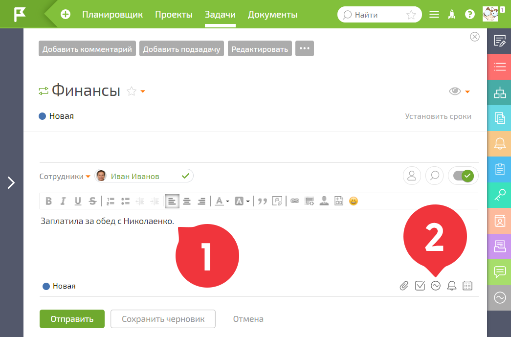
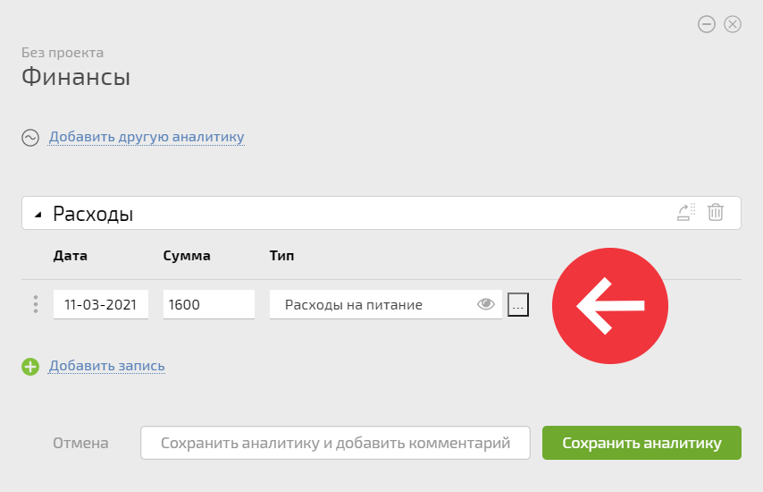
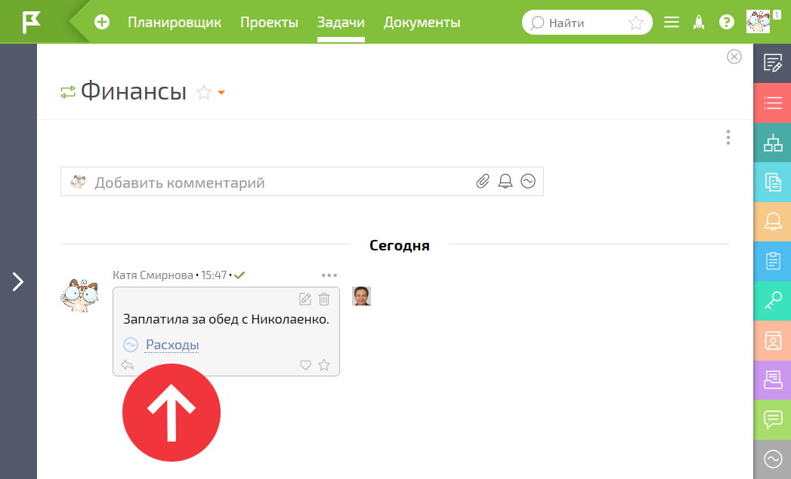

Для того, чтобы внести в ПланФикс информацию о полученном доходе или понесенных расходах, необходимо добавить аналитику **Доходы** или **Расходы** к любой задаче. Лучше всего добавлять аналитики непосредственно в те задачи, в рамках которых были получены доходы или понесены расходы — это даст дополнительный срез информации для отчетов. 

Добавляя аналитику к задаче, в комментарии указывайте дополнительные пояснения по операции: 

  

## Обратите внимание

В ПланФиксе можно создавать специальные задачи для нужд учета. Например, задачи: **Расходы на доставку товара** или **Доходы от мелкого ремонта**.
