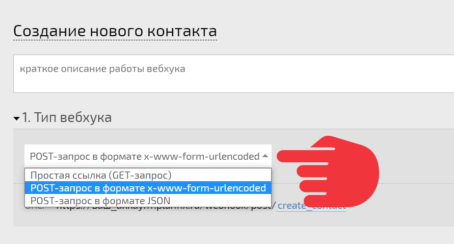
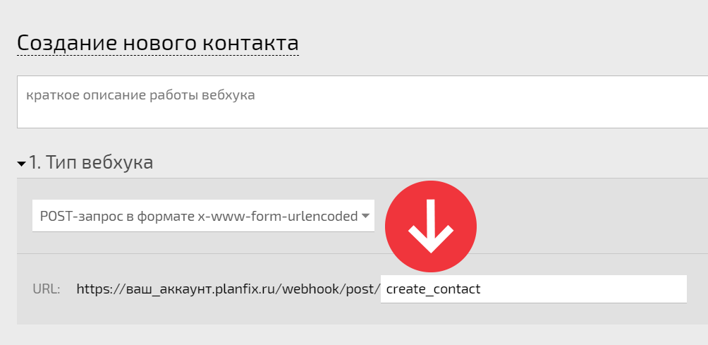
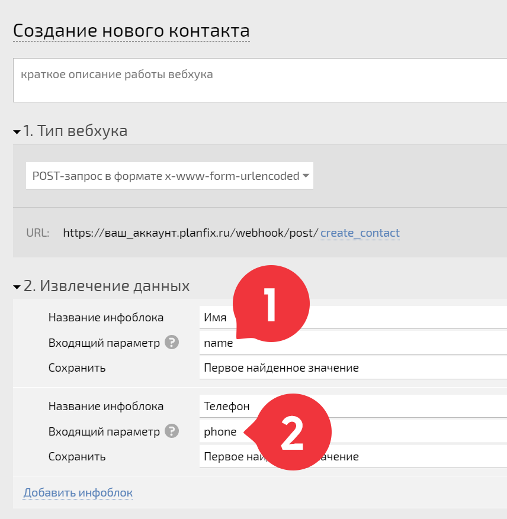
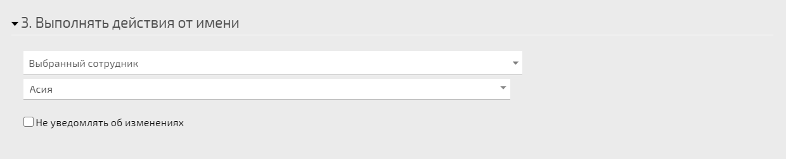
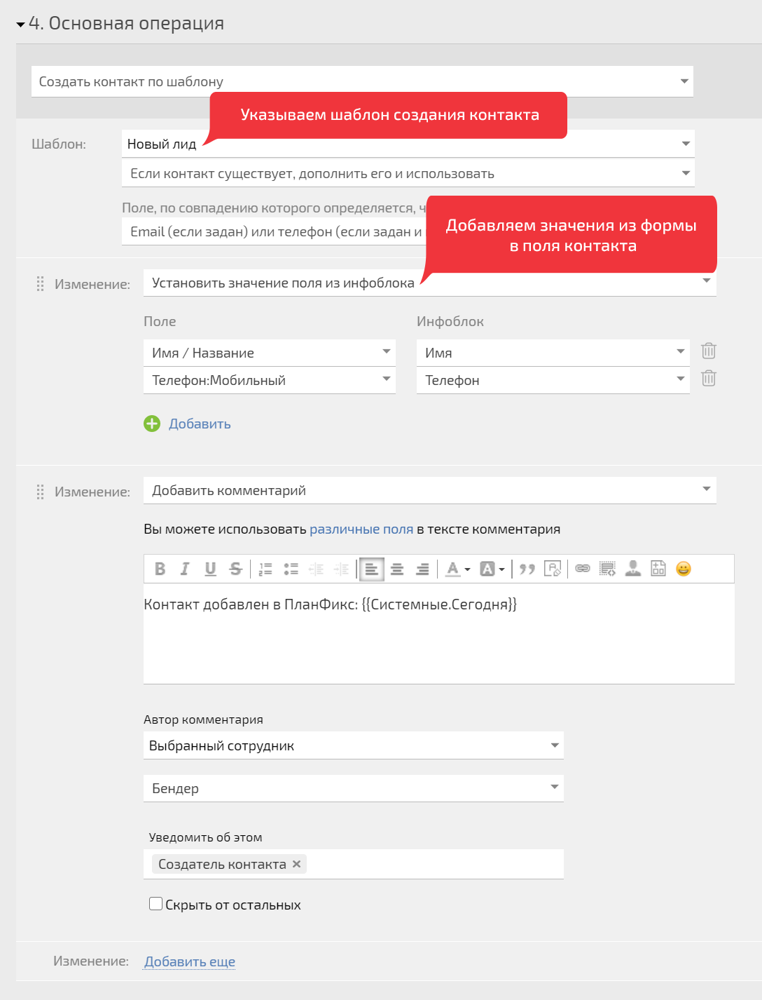
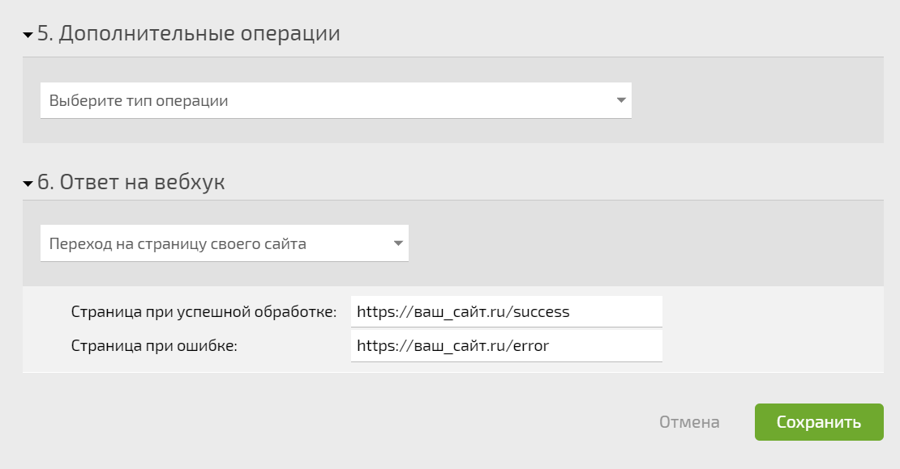
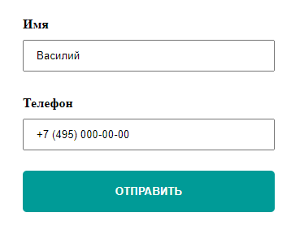
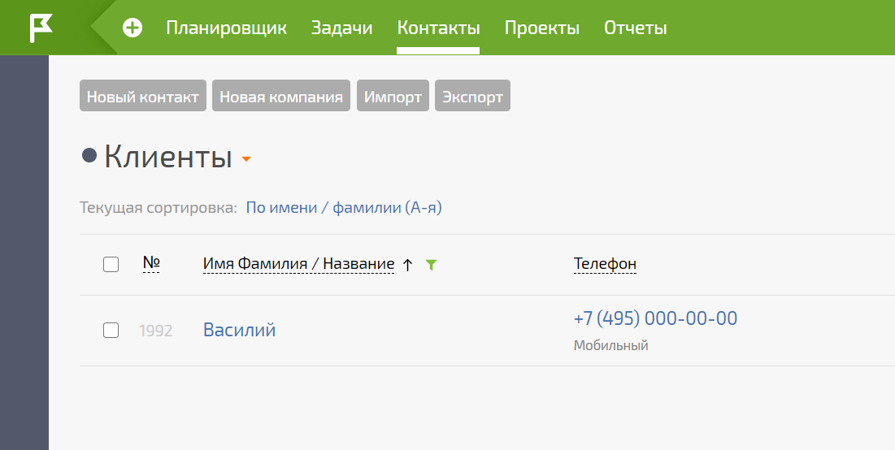

Для того, чтобы понять как работают [вебхуки](Входящие_вебхуки.md "Входящие вебхуки") с POST-запросом, рассмотрим простой пример создания контакта в ПланФиксе после заполнения формы обратной связи на сайте. 

Пример вебхука с POST-запросом: 

    

    

    https://ваш_аккаунт.planfix.ru/webhook/POST/create_contact

    

  

Настроим вебхук, который будет создавать контакты: 

  * В типе указываем POST-запрос:

  

  * Ссылка вебхука содержит уникальный код, но при желании его можно заменить на более информативный для человека:

  

  * В параметры вебхука добавляем имена полей из формы обратной связи:

  

  * Указываем от чьего имени будет выполняться действие в ПланФиксе после того, как сработает вебхук:

  

  * Выбираем тип операции и настраиваем его. В итоге ПланФикс создаст новый контакт по выбранному шаблону, добавит Имя из параметра ссылки **name** и Телефон из параметра ссылки **phone** , затем оповестит нужного сотрудника о новом контакте:

  

  * Далее добавляем дополнительные операции при необходимости и на последнем шаге указываем, какой ответ от вебхука хотим получить — JSON, переход на страницу ПланФикса или личного сайта:

  

  * Добавляем ссылку вебхука в код формы обратной связи на сайте:

<form method="post" action="https://ваш_аккаунт.planfix.ru/webhook/POST/create_contact">  

<input type="text" name="name" placeholder="Имя">  

<input type="text" name="phone" placeholder="Телефон">  

<input type="submit" name="submit" value="Отправить">  

</form>

  

  * Когда клиент заполнит в форме обратной связи **имя** и **телефон** , а затем кликнет на кнопку **Отправить** :

  

  * Значения из полей формы добавятся в вебхук и отправятся в ПланФикс, где автоматически создастся новый контакт:

