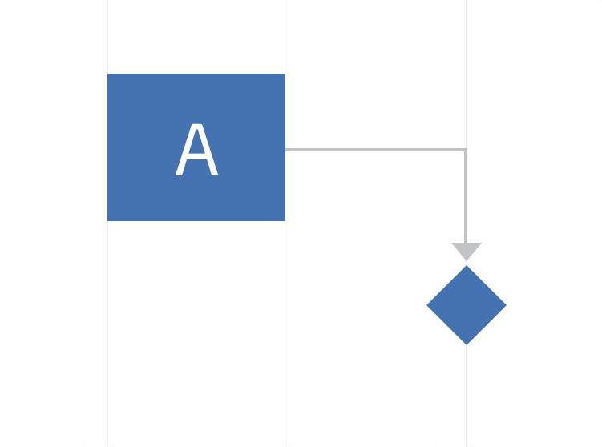
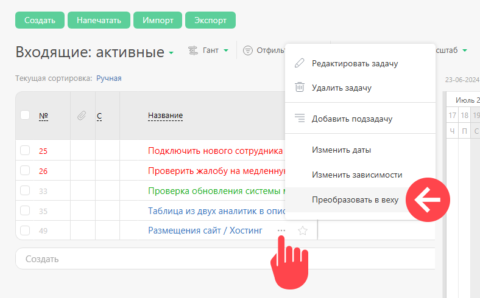
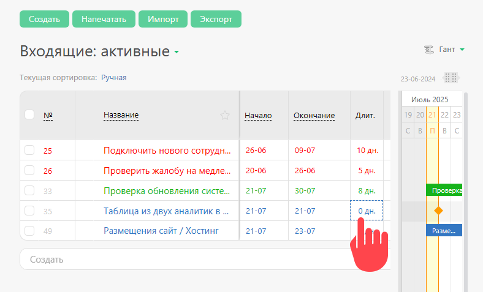

**Веха** — в управлении проектами контрольная точка, значимый, ключевой момент (например, переход на новую стадию, новый этап в ходе выполнения проекта). Как правило, с этим моментом связано завершение какого-либо ключевого мероприятия, подписание важных документов или любые другие значительные действия, предусмотренные планом проекта. 

В ПланФикс вехой считается любая задача, у которой задана длительность равная 0. 

На [ диаграмме Ганта](Диаграмма_Ганта.md "Диаграмма Ганта") веха обозначается ромбом: 

  

Перевести задачу в веху можно двумя способами: 

  * в выпадающем меню в режиме Диаграмма Ганта:

  

  * в поле **Длительность** задачи, указав явно ноль:

