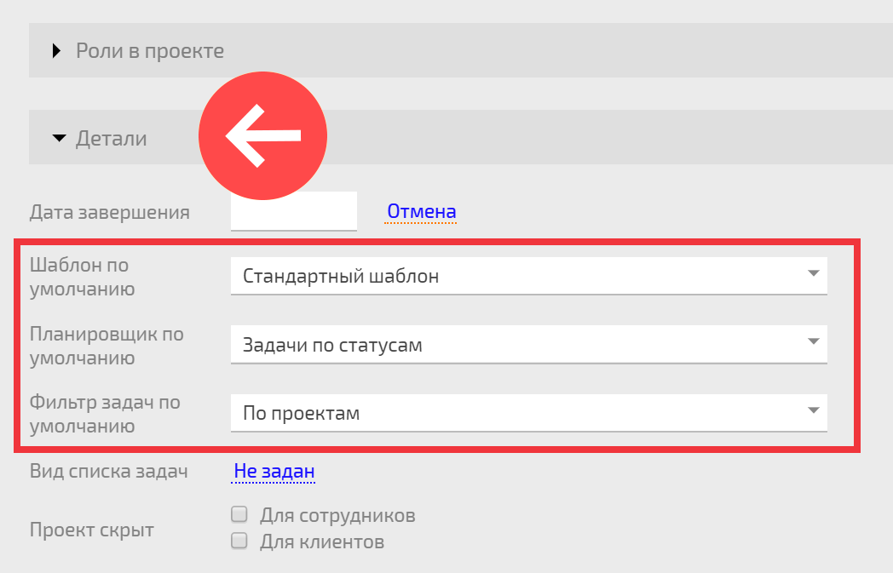

По вашему выбору, задачи [ проекта](Проекты.md "Проекты") могут отображаться в виде нужного [ фильтра](Фильтры_задач.md "Фильтры задач") или [ планировщика](Планировщик.md "Планировщик"). За это отображение отвечает раздел **Детали** в [карточке проекта](Карточка_проекта.md "Карточка проекта"). Он доступен в процессе создания/редактирования проекта или на панели [Детали проекта](Детали_проекта.md "Детали проекта"). Вот так этот блок выглядит при редактировании карточки проекта: 

  

  * **Планировщик по умолчанию** — позволяет выбрать планировщик, в котором будут отображаться задачи проекта в случае, если в **Виде списка задач** будет выбран вариант **Планировщик по умолчанию**

  * **Фильтр задач по умолчанию** — позволяет выбрать фильтр, в котором будут отображаться задачи проекта в случае, если в **Виде списка задач** будет выбран вариант **Фильтр задач по умолчанию**

  * **Отображать проект в виде** — определяет, будут задачи проекта отображаться в виде фильтра или в виде планировщика.

Таким образом, вы можете настроить отображение задач проекта в очень широкой гамме вариантов. После этого, клик на проект в любом месте интерфейса ПланФикса будет открывать задачи этого проекта в фильтре или планировщике, указанном вами в этих настройках. 

## Полезно

  * В [ шаблоне проекта](Шаблоны_проектов.md "Шаблоны проектов") тоже есть аналогичный блок настроек. Задав там нужный вид отображения, вы обеспечите преемственность этой настройки во всех проектах, создаваемых по этому шаблону.
