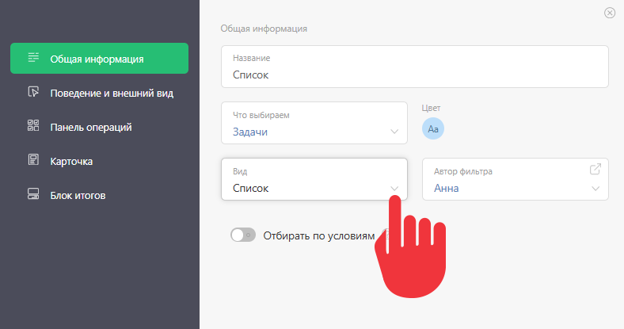

Любой [планировщик](Планировщик.md "Планировщик") состоит из столбцов, которые в интерфейсе называются **списками**. Данные в каждом из таких столбцов-списков могут отображаться по-разному: в виде перечня задач, в виде календаря, расписания и т.п. 

Вид списка выбирается в параметрах настройки списка. 

  

Доступны следующие виды списков: 

  * [ Простой список](Простой_список_Планировщика.md "Простой список Планировщика")

  * [ Список с условиями](Список_в_Планировщике.md "Список в Планировщике")

  * [ Карточки (задач)](Карточки.md "Карточки")

  * [Расписание почасовое](Расписание_почасовое.md "Расписание почасовое")

  * [Расписание по дням](Расписание_по_дням.md "Расписание по дням")

  * [Календарь полный](Календарь_полный.md "Календарь полный")

  * [Календарь почасовой](Календарь_почасовой.md "Календарь почасовой")

  * [Календарь по дням](Календарь_по_дням.md "Календарь по дням")

  * [Хроника в Планировщике](Хроника_в_Планировщике.md "Хроника в Планировщике")

  * [Таблица](Таблица.md "Таблица")

  * [Диаграмма связей](Диаграмма_связей.md "Диаграмма связей")

## Полезные ссылки

  * Как пользоваться [ параметрами отбора](Параметры_отбора_объектов.md "Параметры отбора объектов") задач в списки.
