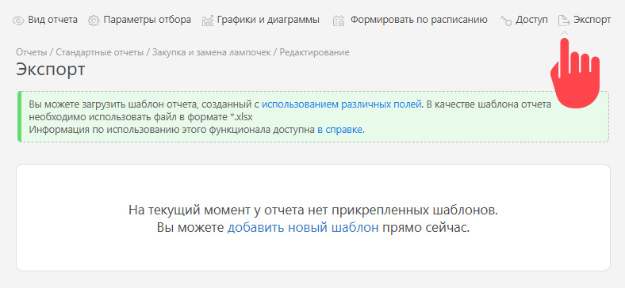
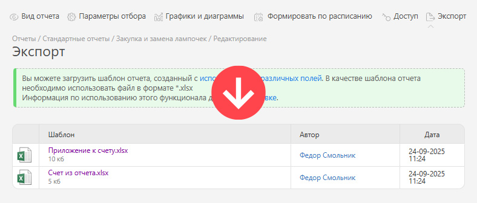

Прикрепить к отчету шаблоны экспорта данных можно на вкладке **Экспорт** в режиме редактирования отчета: 

  

Здесь же прикрепленные шаблоны можно удалять или заменять более актуальными версиями: 

  

## Полезно

  * Также работать с шаблонами для экспорта данных из отчетов можно в подразделе [Шаблоны экспорта отчетов](Шаблоны_экспорта_отчетов.md "Шаблоны экспорта отчетов") раздела **Документы**.
