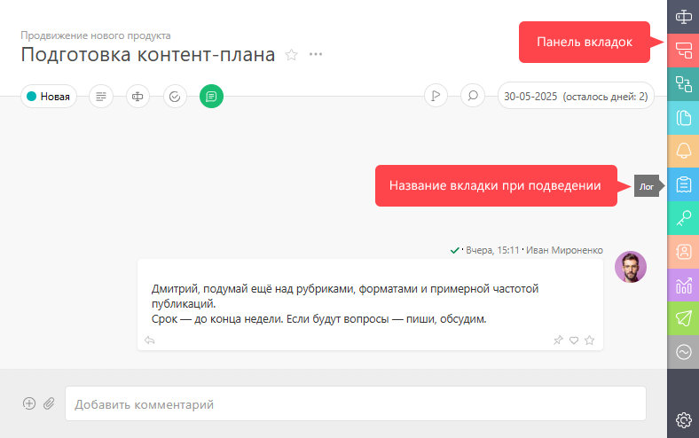
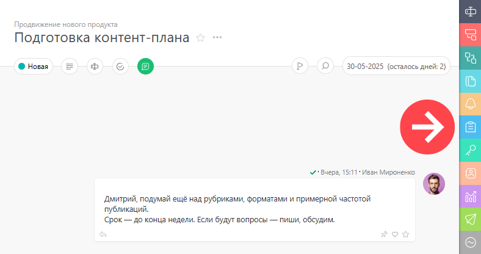

**Вкладки** (панели) с дополнительной информацией открываются в правой части [ карточки задачи](Карточка_задачи.md "Карточка задачи"). Название панелей выводится при наведении курсора: 

  

Панели позволяют разбить информацию об объекте на несколько частей, чтобы упростить ее восприятие. Состав панелей меняется, в зависимости от сути объекта (задача / проект / клиент и т.д.), но переключатель панелей всегда находится в одном и том же месте для задач, проектов, клиентов и других объектов ПланФикса. 

  

## Доступные панели

  * [ Детали](Панель_Детали.md "Панель Детали")

  * [ Подзадачи](Панель_Подзадачи.md "Панель Подзадачи")

  * [ Зависимости](Панель_Зависимости.md "Панель Зависимости")

  * [ Документы](Панель_Документы.md "Панель Документы")

  * [ Напоминания](Панель_напоминаний.md "Панель напоминаний")

  * [ Лог](Панель_Лог.md "Панель Лог")

  * [ Права доступа](Панель_Права_доступа.md "Панель Права доступа")

  * [ Контакты](Панель_Контакты.md "Панель Контакты")

  * [ Отчеты](Панель_Отчеты.md "Панель Отчеты")

  * [ Уведомления](Панель_Уведомления.md "Панель Уведомления")

  * [ Аналитики](Панель_Аналитики.md "Панель Аналитики")

  * [ Связь аккаунтов](Панель_Связь_аккаунтов.md "Панель Связь аккаунтов")
