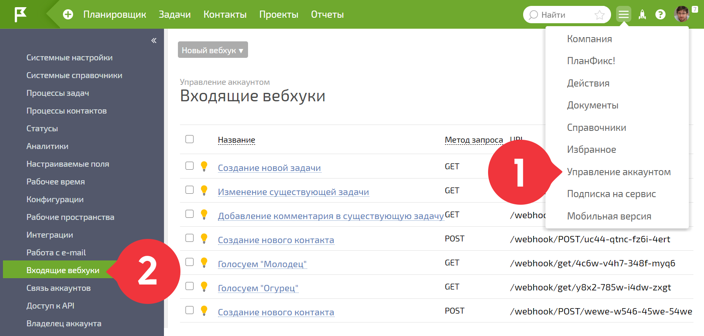
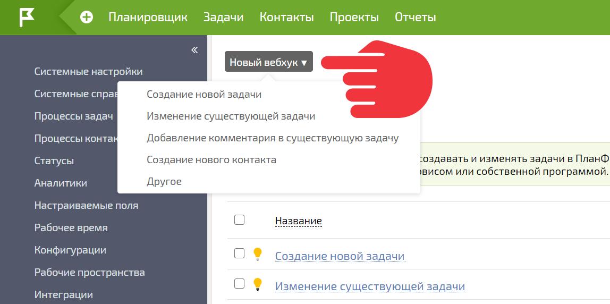
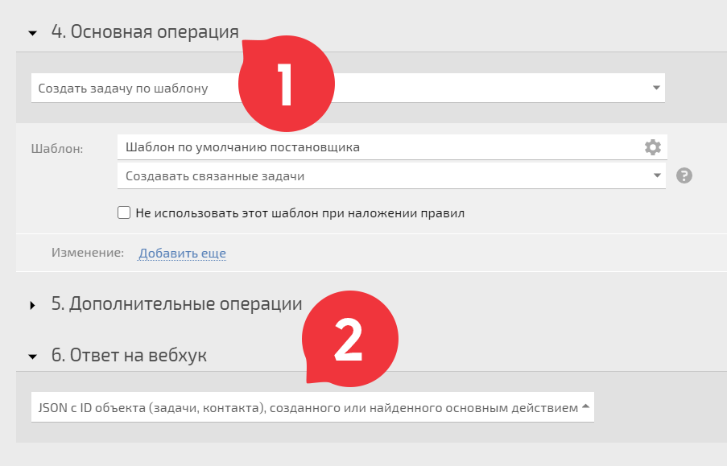

**Входящие вебхуки** — это специальная ссылка, которая позволяет создавать и изменять задачи или добавлять контакты в ПланФикс. Она формируется из определенного типа и параметров. 

Пример вебхука: 

    

    

    https://ваш_аккаунт.planfix.ru/webhook/get/create_task?project=проект&name=название задачи

    

  

Когда по такой ссылке переходит клиент или другой внешний пользователь, в ПланФиксе автоматически запускаются заранее настроенные операции. Это простой способ связать ПланФикс с другим веб-сервисом или собственной программой. 

Вебхуки добавляются в ПланФикс в разделе **Управление аккаунтом** — **Входящие вебхуки** : 

  

По кнопке **Новый вебхук** можно выбрать один из предустановленных вариантов настройки или добавить самостоятельно настроенный вебхук: 

  

## Примеры использования

  * [Вебхук с GET-запросом](Вебхук_с_GET-запросом.md "Вебхук с GET-запросом")

  * [Вебхук с POST-запросом](Вебхук_с_POST-запросом.md "Вебхук с POST-запросом")

  * [Вебхук принимает данные из Jenkins](Вебхук_принимает_данные_из_Jenkins.md "Вебхук принимает данные из Jenkins")

  

## Дополнительная информация

  * [Входящие вебхуки: получаем данные в ПланФикс без промедления](https://planfix.com/ru/blog/vhodyashchie-vebhuki-poluchaem-dannye-v-planfiks-bez-promedleniya/)

  * [Приходящие в ПланФикс вебхуки можно разбирать, используя JSON. Для этого используется библиотека JsonPath](https://planfix.ru/docs/JSONPath)

  * [Как отправлять заказы из Тильды в ПланФикс](https://planfix.com/ru/blog/kak-otpravlyat-zakazy-iz-tildy-v-planfiks/)

## Важно

  * Входящие вебхуки возвращают JSON с номером созданной задачи (2) только из основной операции (1):

