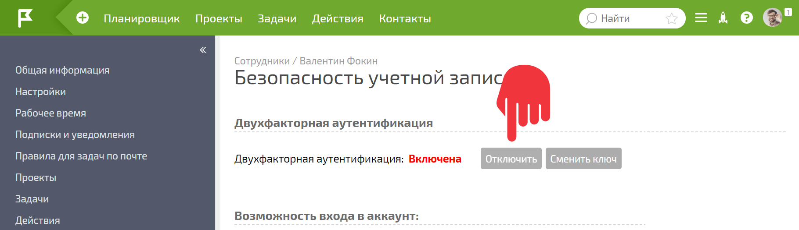
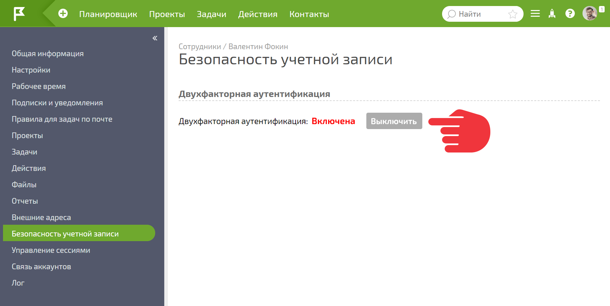
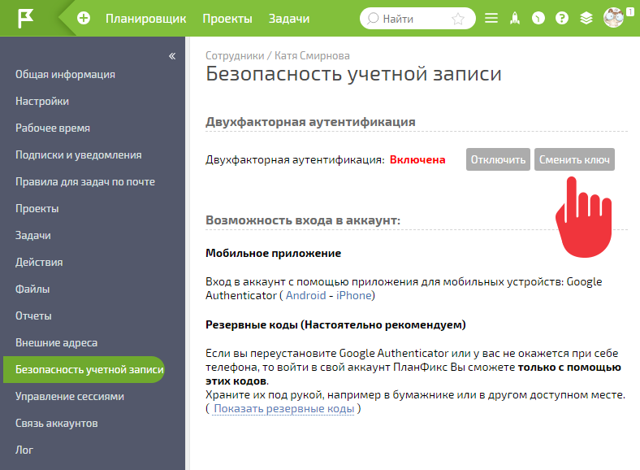

[Двухфакторная аутентификация](Двухфакторная_аутентификация.md "Двухфакторная аутентификация") может быть отключена самим пользователем или администратором аккаунта при условии, что двухфакторная аутентификация не включена на уровне всего аккаунта. Выключить её в таком случае нельзя. Можно сбросить ключ, и при новом входе система потребует настроить её заново. 

  

## Отключение двухфакторной аутентификации пользователем

Сотрудник может отключить двухфакторную аутентификацию на своей [ странице пользователя](Страница_пользователя.md "Страница пользователя"), на вкладке **Безопасность учетной записи** : 

  

Для отключения понадобится ввести одноразовый пароль, сгенерированный приложением Google Authenticator или [ резервный пароль](Использование_резервных_паролей.md "Использование резервных паролей"), сохраненный после включения двухфакторной аутентификации. 

Если по какой-либо причине пользователь не может самостоятельно отключить двухфакторную аутентификацию (утерян смартфон, переустановлено приложение и т.п.) и резервные пароли отсутствуют, он может обратиться к администратору своего аккаунта, который имеет возможность отключать двухфакторную аутентификацию для пользователей. 

  

## Отключение двухфакторной аутентификации администратором

Администратор аккаунта может отключить двухфакторную аутентификацию в карточке пользователя на панели **Безопасность учетной записи** : 

  

## Важно

  * Если администратор сам попал в ситуацию, когда ему необходимо отключить двухфакторную аутентификацию для своей учетной записи, а пароля для этого у него нет, он может сделать запрос в [Службу поддержки ПланФикса](https://planfix.ru/support/) с объяснением ситуации. Для восстановления доступа к своей учетной записи ему придется пройти определенную проверку, с деталями которой его ознакомят в ходе обработки запроса.

  * Если в аккаунте включен режим, который всех сотрудников обязывает использовать двухфакторную аутентификацию, а кому-то необходимо точечно её отключить, для этого используйте опцию «Сменить ключ». Она сбросит текущую двухфакторную аутентификацию и при следующем входе запустит настройку новой:

