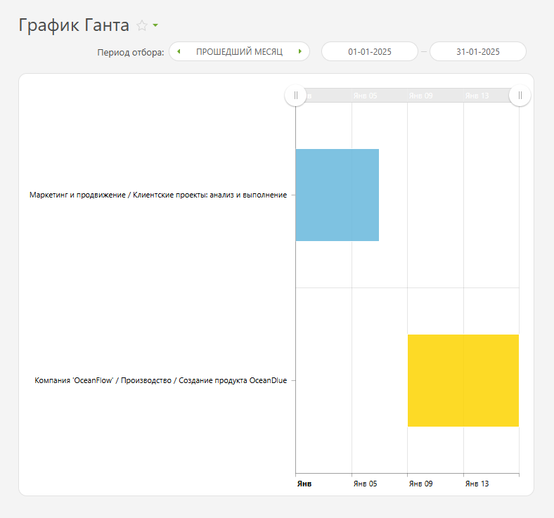
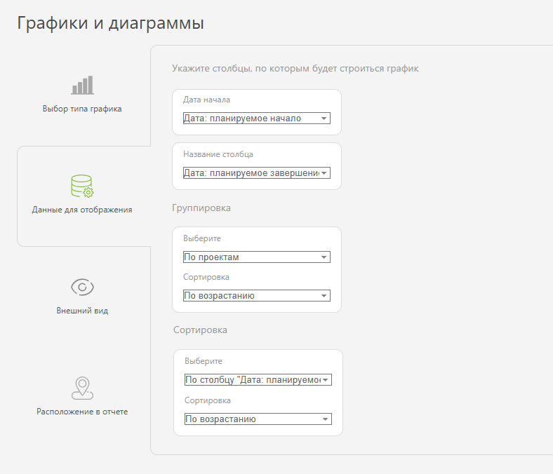
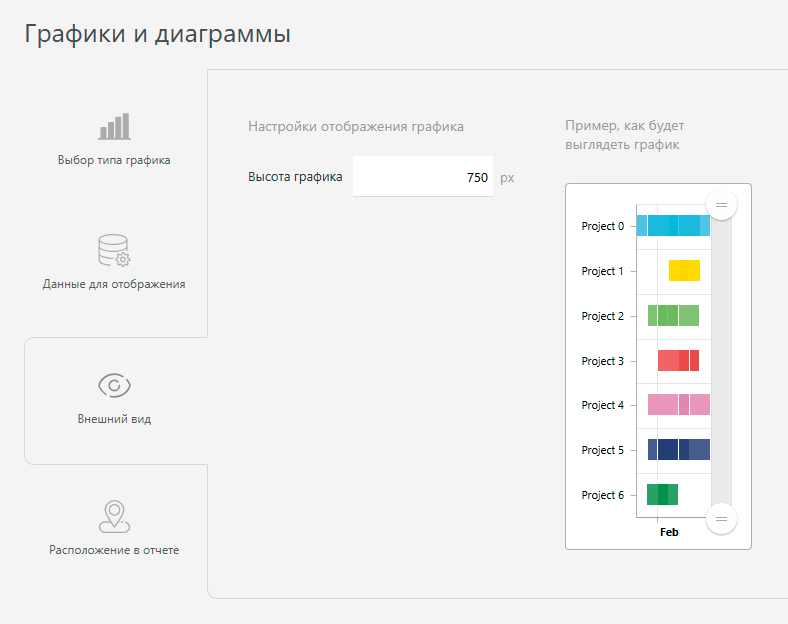

График Ганта — это тип диаграммы в [отчетах](Отчеты__Графики_в_отчетах.md "Отчеты: Графики в отчетах") ПланФикса. Он представляет задачи в виде горизонтальных полос на временной шкале, отображая их начало, длительность и завершение. График Ганта помогает планировать проекты и отслеживать сроки. 

Вот так отображаются планируемые сроки по проектам: 

  

График Ганта строится на основе данных из отчета и состоит из двух осей: 

  * Горизонтальная ось (X) — временная шкала, разбитая по дням. Показывает, когда начинается и заканчивается каждая задача проекта.

  * Вертикальная ось (Y) — список проектов, каждому из которых соответствуют временные интервалы выполнения.

Группировку и сортировку данных в этом графике можно не использовать. Но если они нужны, важно, чтобы в столбцах, на основе которых строится график, выводилась дата начала или завершения. Без этого график не сможет корректно отобразить данные. 

## Как настроить

  * В «Вид отчета» добавьте столбцы с данными, по которым будет собран График Ганта.

  * Далее в разделе «Графики и диаграммы» добавьте новый график типа «График Ганта»:

    

  

  * В «Данных для отображения» укажите значения: 

    * Столбцы, по которым будет строиться график: «Дата: планируемое начало», «Дата: планируемое завершение».

    * Группировка: По проектам и по возрастанию.

    * Сортировка: По столбцу «Дата: планируемое начало» и по возрастанию.

    

  

  * В «Внешнем виде» настройте отображение графика: 

    * Высота графика — определяет высоту отображаемого графика в пикселях.

  

  * Сохраните график и запустите отчет для просмотра.
