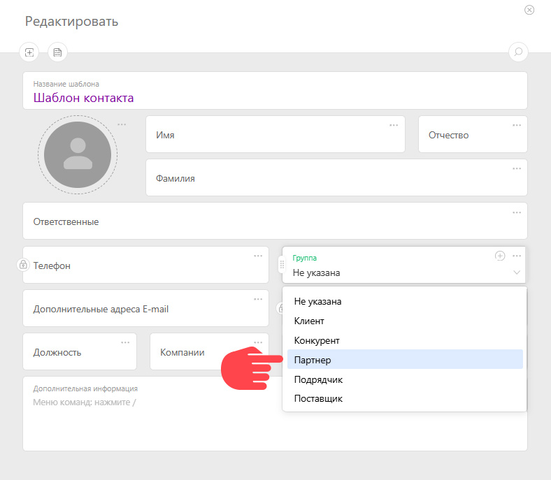
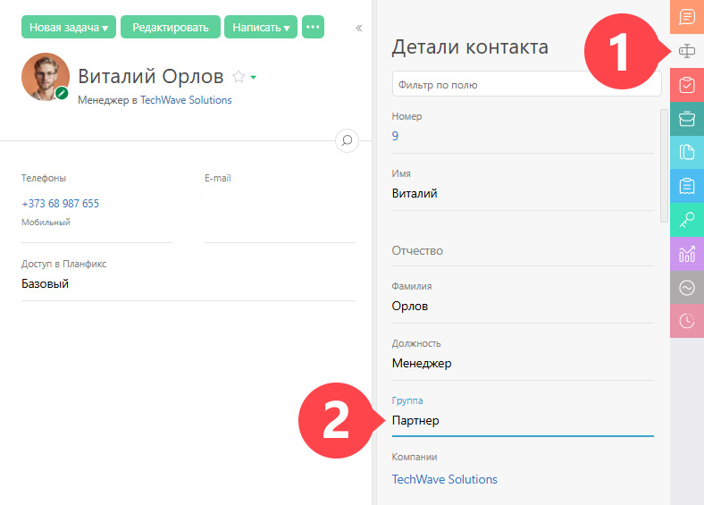
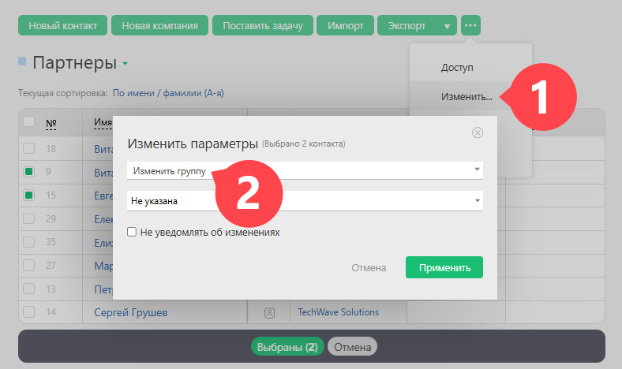

Для удобства работы в ПланФикс [контакты](Контакты.md "Контакты") можно объединить в группы по какому-либо признаку, например: клиенты, партнеры, разовые сотрудники. 

Настройка находится в "Управление аккаунтом" — "Системные справочники" — "Группы контактов". Доступно для администраторов аккаунта. Администратор может создать новую группу контактов или редактировать существующие. 

## Использование групп контактов

1\. Группу можно указать при создании контакта: 

  

2\. Там же можно создать новую "Группу контактов", если необходимой нет в списке. 

3\. Существующий контакт также можно добавить к группе: 

  * Через "Детали контакта":

  

  * Массовым действием:

## Важно

  * Система не дает возможности ставить задачи или добавлять в участники задач сразу группу контактов. Это связано с [ограничениями по работе в ПланФиксе для внешних пользователей](Ограничения_по_работе_в_ПланФиксе_для_внешних_пользователей.md "Ограничения по работе в ПланФиксе для внешних пользователей").
