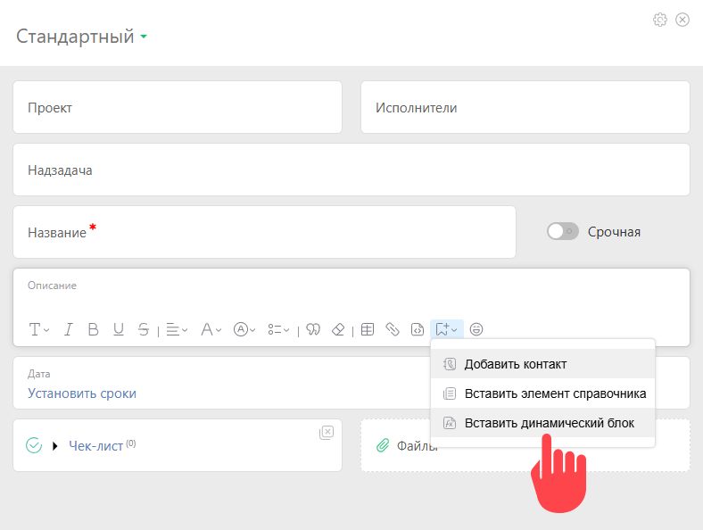
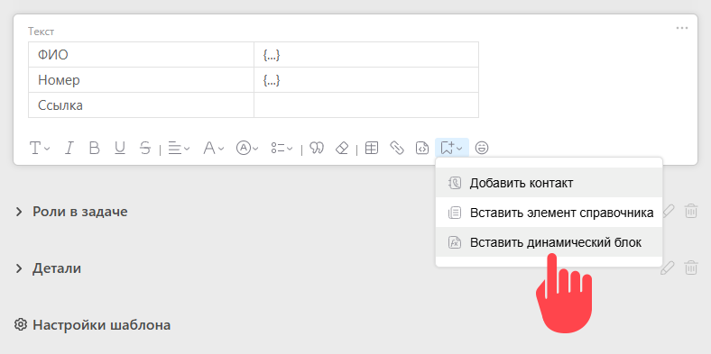
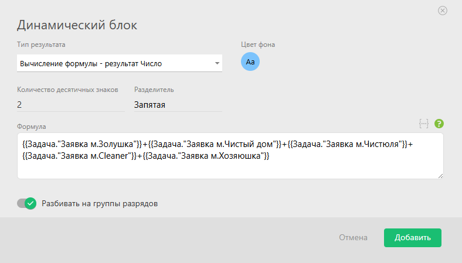
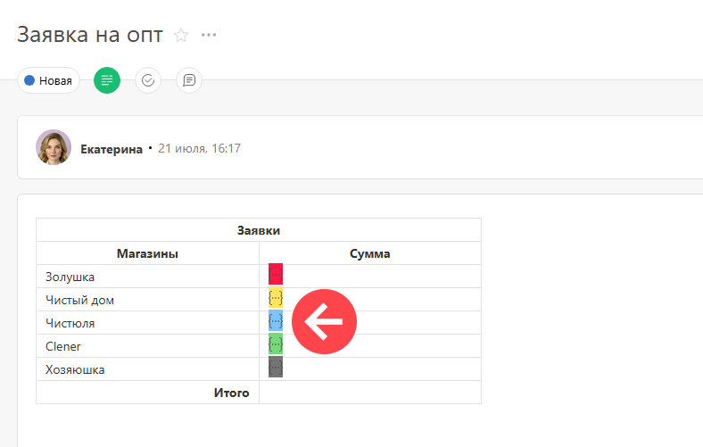
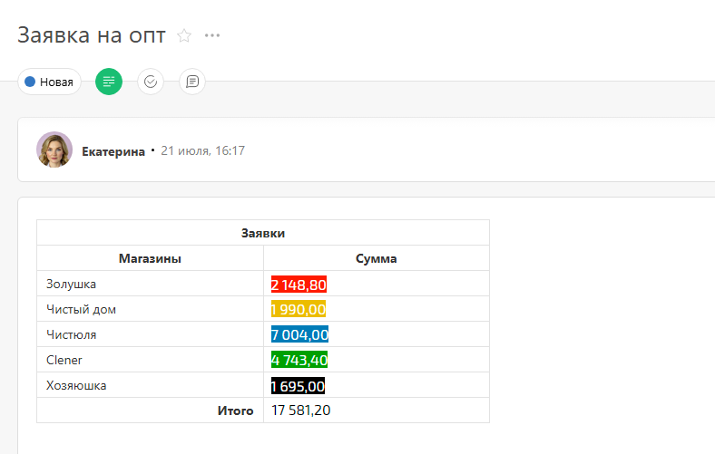
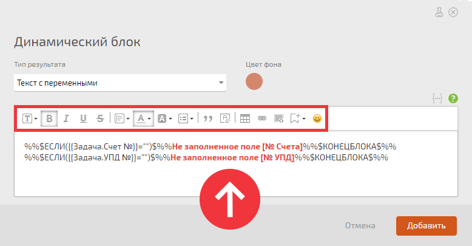
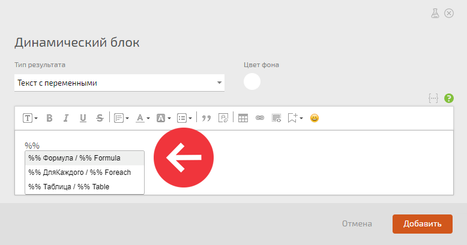

**Динамический блок** — это специальный блок в [описании задачи](Основная_информация_по_задаче.md "Основная информация по задаче") с переменными и формулами, которые вычисляются при каждом её открытии. С помощью динамического блока отображаются значения: 

  * переменных;

  * формул, привязанных ко времени;

  * формул, ссылающихся по длинной цепочке на часто меняющиеся объекты ПланФикса;

  * полей контрагентов или проектов.

Динамический блок добавляется в описание задачи при её создании или редактировании: 

  

Динамический блок также можно добавить в [шаблон задачи](Шаблоны_задач.md "Шаблоны задач") и в пользовательское поле типа «[Текст](Текст.md "Текст")»: 

  * При этом у поля должна быть активирована опция «Использовать редактор текста».

## Настройка динамического блока

  * Выберете [тип получаемого результата](Вычисляемые_поля_задач.md "Вычисляемые поля задач") и цвет фона, на котором он будет отображаться.

  * Нажмите на троеточие в фигурных скобках, чтобы добавить переменную или формулу в блок.

  * Сформируйте переменную:

  

  * Или соберите формулу из переменных:

  

Так динамический блок отображается в таблице при редактировании описания задачи. Для того, чтобы отредактировать динамический блок, кликните на троеточие. 

  

При открытии задачи данные в динамическом блоке пересчитаются, и вы увидите итоговый результат: 

## Особенности работы

При выборе типа результата «Текст с переменными» можно использовать все [ конструкции](Переменные_в_тексте.md "Переменные в тексте") и форматировать текст с помощью встроенного редактора: 

  

Воспользуйтесь автозаполнением для добавления конструкций. Для того, чтобы вызвать окно выбора, введите «%%» (два знака процента) и выберите нужное: 

## Важно

  * Динамические блоки работают в описании карточки задачи или поле типа «Текст» с включенным редактором.

  * С помощью динамического блока решаются [кейсы](https://planfix.com/ru/blog/dinamicheskie-bloki-v-opisanii-zadachi/), которые нельзя решить [вычисляемыми полями](Вычисляемые_поля.md "Вычисляемые поля").

  * Динамические блоки отображаются всегда с новой строки. Но если вы хотите отобразить рядом в одной строке текст и динамический блок — добавьте этот текст внутрь динамического блока, в таком случае результат отобразится на одной строке.

## Дополнительно

  * Блог ПланФикса: [Динамические блоки в описании задачи](https://planfix.com/ru/blog/dinamicheskie-bloki-v-opisanii-zadachi/)

  * [Вселенная «Колеса»: решайте бизнес-задачи с помощью динамических блоков](https://planfix.com/ru/blog/vselennaya-kolesa-reshajte-biznes-zadachi-s-pomoshchyu-dinamicheskih-blokov/)
