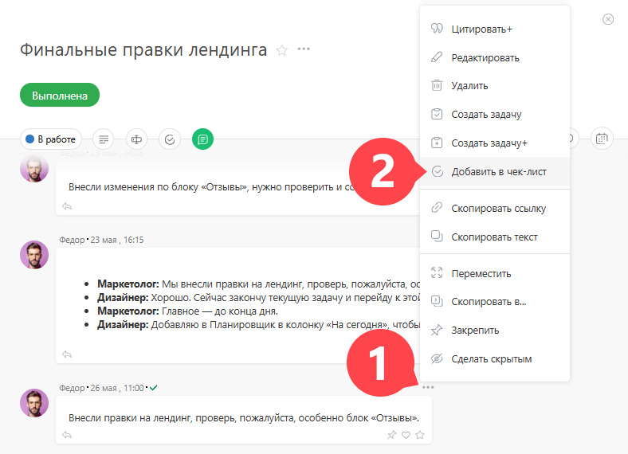
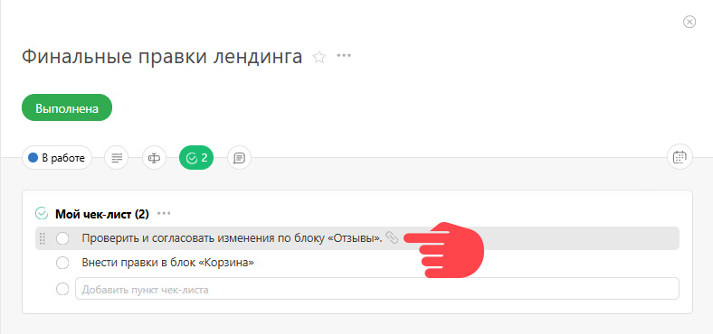

[ Комментарий](Действия__(комментарии_.md) "Действия \(комментарии\)") можно добавить в [ чек-лист](Чек-лист.md "Чек-лист"). Делается это из контекстного меню любого комментария, кликнув на пункт **Добавить в чек-лист** : 

 _Изображение может отличаться в зависимости от выбранного[вида отображения](Лента_комментариев_задачи.md "Лента комментариев задачи") комментариев._

  

Это позволяет фиксировать в чек-листе договоренности и этапы работ, о которых вы договорились в ходе общения по задаче. Этот способ удобен еще и тем, что кликнув на иконку ссылки в таком пункте чек-листа, можно быстро перейти к комментарию, с которым он связан, и который может содержать дополнительную информацию: 

