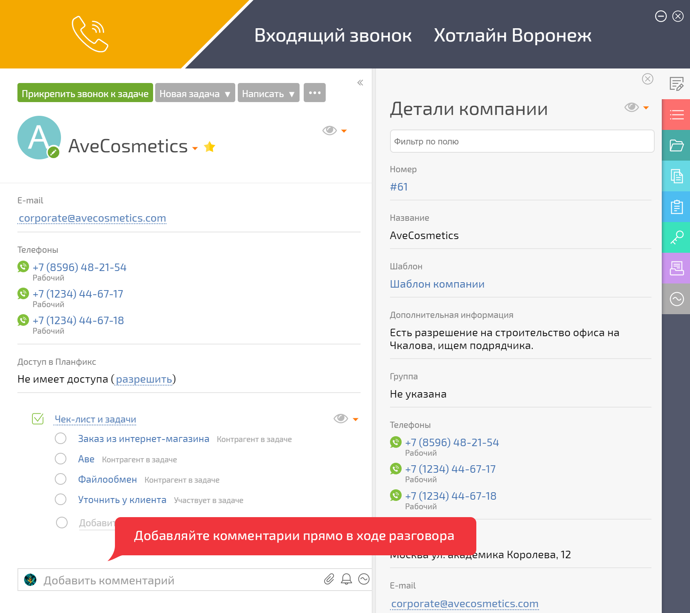

При поступлении входящего звонка, который [ АТС](Виртуальные_АТС.md "Виртуальные АТС") адресует на внутренний, короткий номер сотрудника, он увидит окно, в котором есть возможность как добавить текстовый комментарий, файл, напоминание или аналитику, так и дополнить нужные вам данные контакта прямо в ходе разговора: 

  

  

Добавленный комментарий попадет в [карточку контакта](Карточка_контакта.md "Карточка контакта") или в [ выбранную задачу](Задачи.md "Задачи"), вместе с информацией о звонке.
