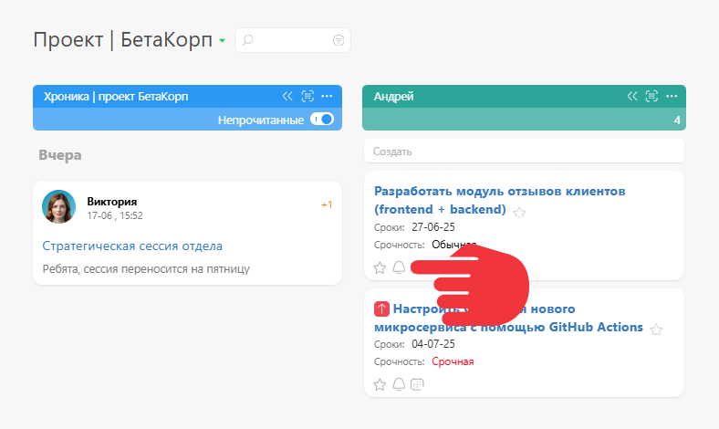
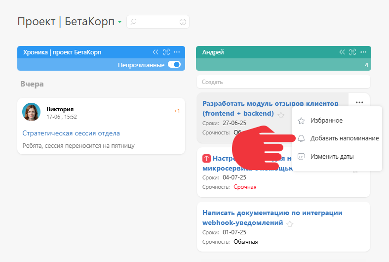

Вы можете добавить [ напоминание](Напоминания.md "Напоминания") о событии в [Планировщик](Планировщик.md "Планировщик"). Вызов интерфейса добавления напоминания зависит от настроек, используемых в конкретном списке Планировщика: 

  * Если в списке включен режим [Использовать полную форму](Использовать_полную_форму.md "Использовать полную форму"), достаточно подвести курсор к нужному событию:

  

  * Если этот режим отключен, пиктограмма "Колокольчик" будет доступна в карточке задачи, которая появится при клике на задачу в планировщике:

  

  * Для списков, в которых сразу отображаются карточки задач/контактов, возможно расположение пиктограммы добавления напоминания на панели операций:

  

или в меню операций: 

## Важно

  * Во всех случаях наличие пиктограммы добавления напоминания в списке операций определяется [ настройками меню списка Планировщика](Настройка_отображения_карточки_в_планировщике.md "Настройка отображения карточки в планировщике"). Если вы не находите пиктограммы "Колокольчик" в меню операций или в принципе не видите меню, загляните в настройки этого списка.
