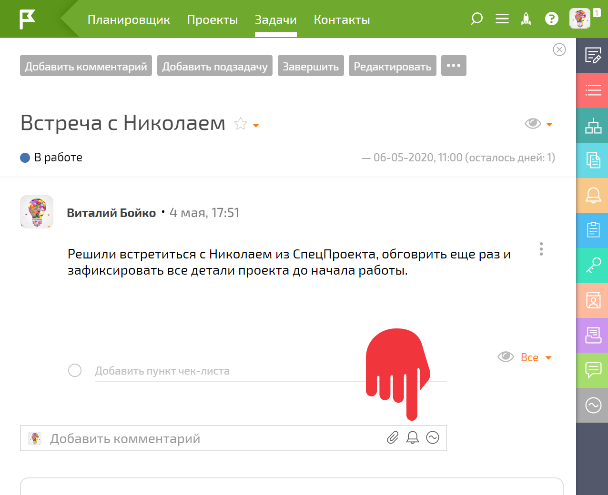
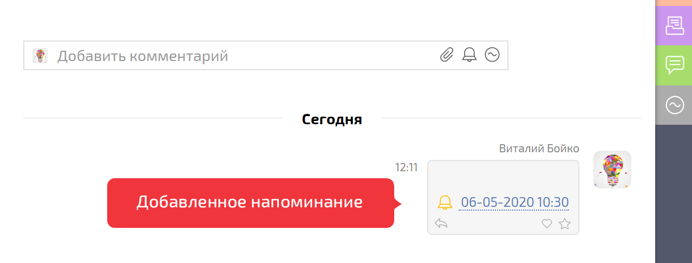

Вы можете прикрепить [ напоминание](Напоминания.md "Напоминания") к существующей [ задаче](Задачи.md "Задачи"). 

Для добавления напоминания к задаче: 

  * Нажимаем на пиктограмму "Колокольчик":

  

  * Попадаем в [интерфейс добавления напоминания](Интерфейс_добавления_напоминания.md "Интерфейс добавления напоминания")

  * Добавленное напоминания отображается в ленте задачи и сработает в назначенное время:

  

## Полезно

  * Вы также можете добавить напоминание к задаче при [ создании нового действия](Добавление_напоминания_к_действию.md "Добавление напоминания к действию").
