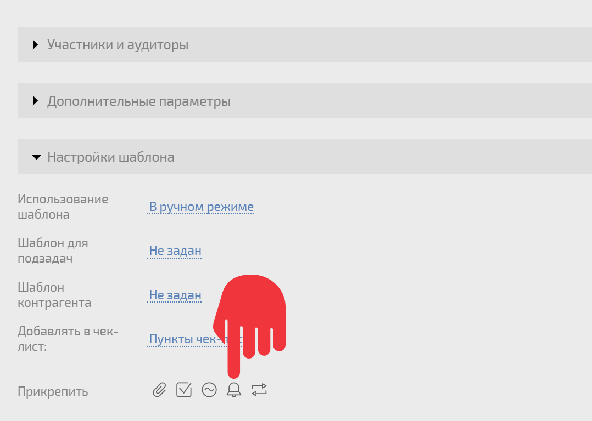
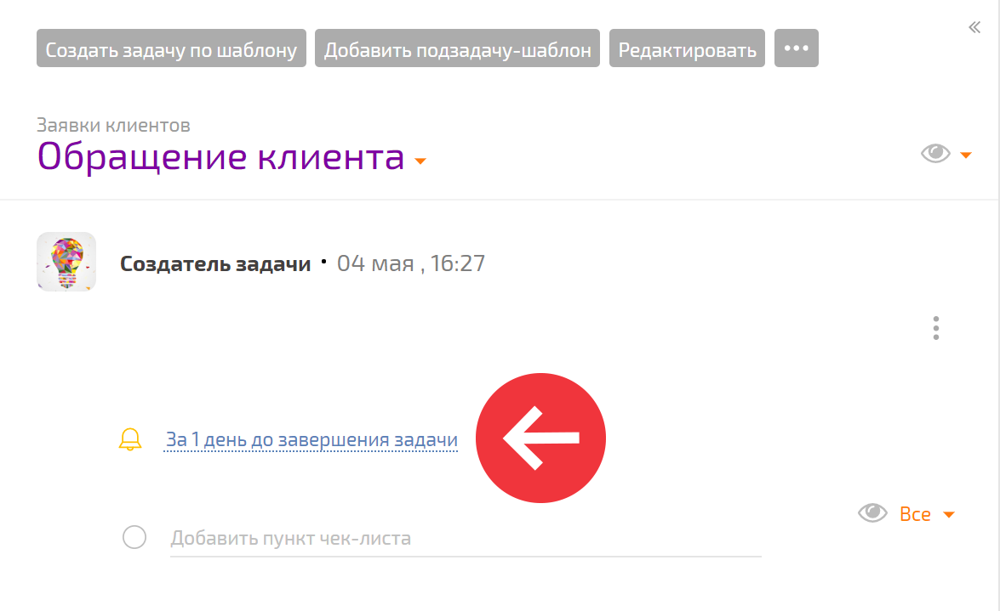
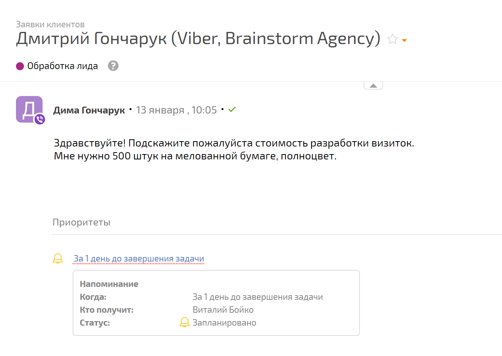
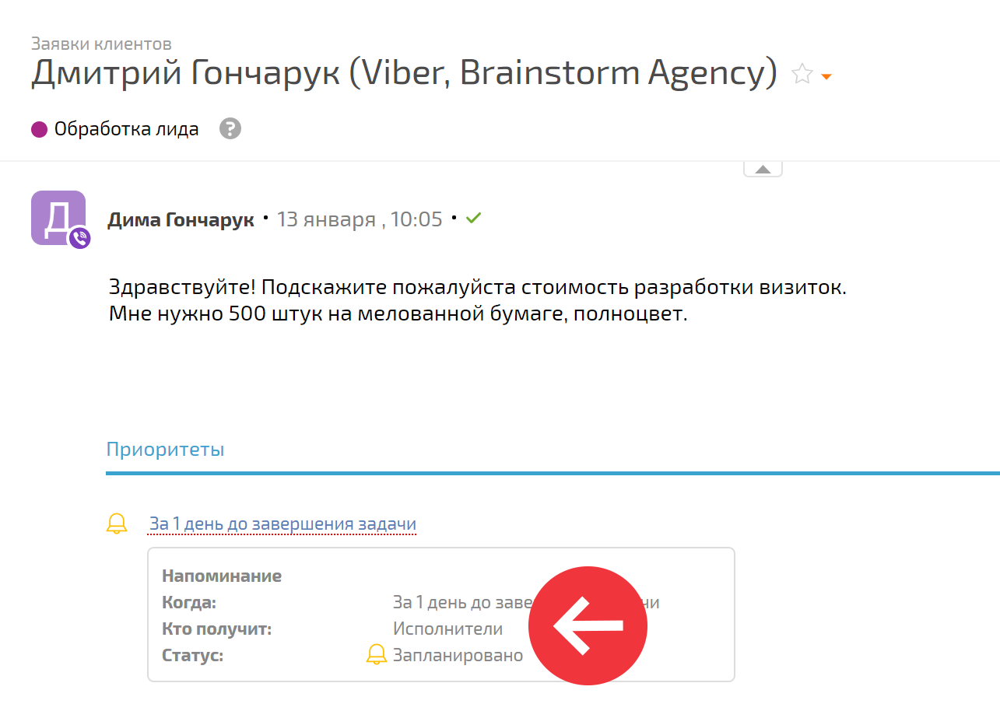

Вы можете добавить [ напоминание](Напоминания.md "Напоминания") к [ шаблону задачи](Шаблоны_задач.md "Шаблоны задач"): 

  * Создаем новый или редактируем существующий шаблон задачи:

  * Нажимаем на пиктограмму добавления напоминания:

  

  * Попадаем в стандартный [интерфейс добавления напоминания](Интерфейс_добавления_напоминания.md "Интерфейс добавления напоминания").

  * Сохраняем шаблон задачи.

Получаем шаблон задачи с напоминанием: 

  

Теперь напоминание будет присутствовать во всех задачах, созданных по этому шаблону: 

  

## Полезно

  * Получателями могут быть не только конкретные люди, но и роли в задаче: [ аудитор](Аудитор_задачи.md "Аудитор задачи"), постановщик, [ исполнители](Исполнители_задачи.md "Исполнители задачи") и [участники задачи](Участники_задачи.md "Участники задачи"):

  

    В этом примере напоминания будут добавлены в каждую задачу, созданную по такому шаблону, а получателями напоминаний в этих задачах станут их аудиторы.

  * Напоминания, прикрепленные к шаблону после его создания, при редактировании, не появятся в задачах, уже созданных по этому шаблону.

  

## Перейти:

  * [Шаблоны задач](Шаблоны_задач.md "Шаблоны задач")

  * [Задачи](Задачи.md "Задачи")

  * [Напоминания](Напоминания.md "Напоминания")
