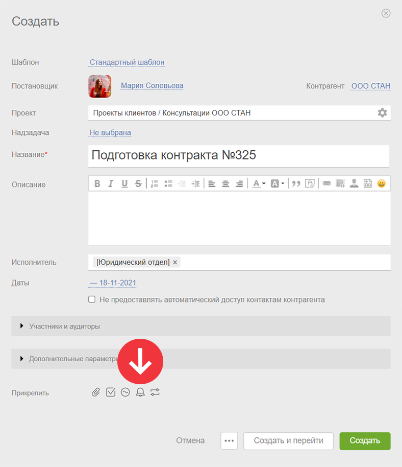
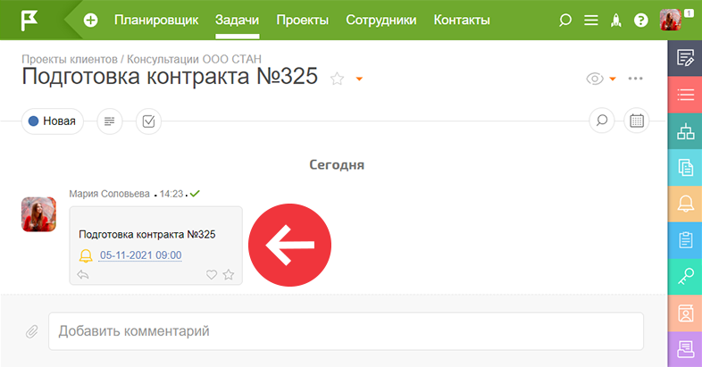

Вы можете добавить [ напоминание](Напоминания.md "Напоминания") о задаче сразу же при [ создании задачи](Как_создать_новую_задачу_.md "Как создать новую задачу?"). 

Для этого: 

  * Создаем новую задачу

  * Нажимаем добавить напоминание:

  

  * Попадаем в стандартный [интерфейс добавления напоминания](Интерфейс_добавления_напоминания.md "Интерфейс добавления напоминания").

  * Сохраняем задачу.

  

Напоминание появляется в описании задачи и сработает в назначенное время: 

