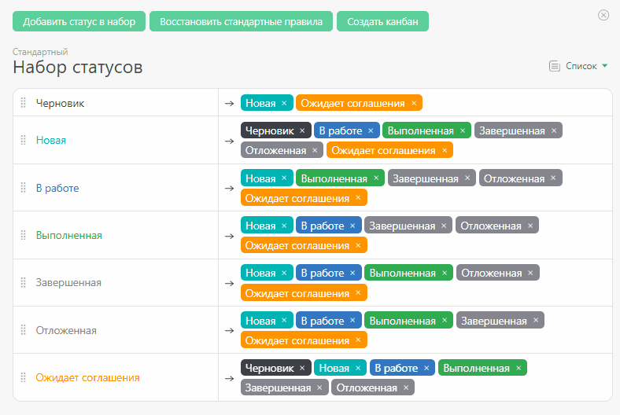

Новые статусы можно добавить следующими способами: 

  * В [Управлении аккаунтом](Аккаунт.md "Аккаунт") — в разделе "Статусы".

  * В [Объекте](Объекты.md "Объекты") — в "Наборе статусов".

В обоих случая открывается стандартный интерфейс создания статуса. 

В окне создания статуса можно: 

  * Задать цвет, которым будет отображаться статус.

  * Выбрать стиль шрифта.

  * Выбрать [ тип статуса](Тип_статуса_задачи.md "Тип статуса задачи") (активный или неактивный), который влияет на отбор задач в таком статусе в фильтрах.

  * Определить, будет этот статус устанавливаться для всей задачи [в общем, или индивидуально](Общие_и_индивидуальные_статусы_задач.md "Общие и индивидуальные статусы задач") для каждого исполнителя.

  * Определить, будут ли [ отслеживаться даты](Отслеживание_даты_планируемого_завершения_для_задач_в_разных_статусах.md "Отслеживание даты планируемого завершения для задач в разных статусах") планируемого завершения задачи в данном статусе (станет ли она просроченной, если задача будет находиться в этом статусе после окончания этой даты).

  * Задать [ подсказку](Подсказки.md "Подсказки"), описывающую суть статуса и работу с ним.

Если вы затрудняетесь с выбором, лучше оставьте значение по умолчанию. 

Во всех интерфейсах ПланФикса статусы будут расположены в установленном вами порядке. Для изменения положения статуса в списке, тяните за специальный элемент: 

  

После того, как все нужные статусы добавлены, можно переходить к [настройке правил перехода между статусами](Настройка_правил_перехода_между_статусами.md "Настройка правил перехода между статусами").
