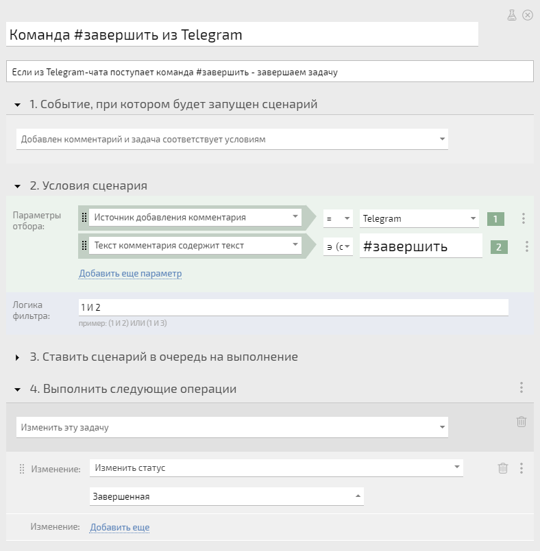

При помощи [ автоматических сценариев](Автоматические_сценарии.md "Автоматические сценарии") вы можете добавлять собственные команды управления ПланФиксом из внешних источников (чатов, мессенджеров, электронной почты и т.п.) подключенных при помощи [ интеграций](Интеграции.md "Интеграции"). 

Для этого используется автоматический сценарий, срабатывающий на событие добавления нового комментария и анализирующий его текст. Из текста выделяется слово-команда и выполняются заложенные вами действия. 

Пример сценария для команды **#завершить** , при помощи которой можно завершить задачу из [Telegram](Telegram.md "Telegram"): 

