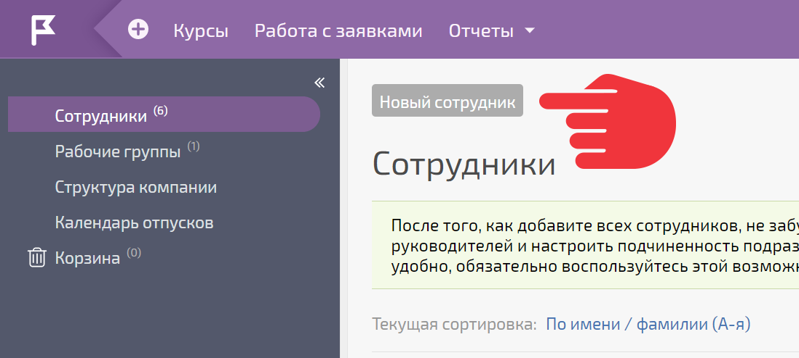
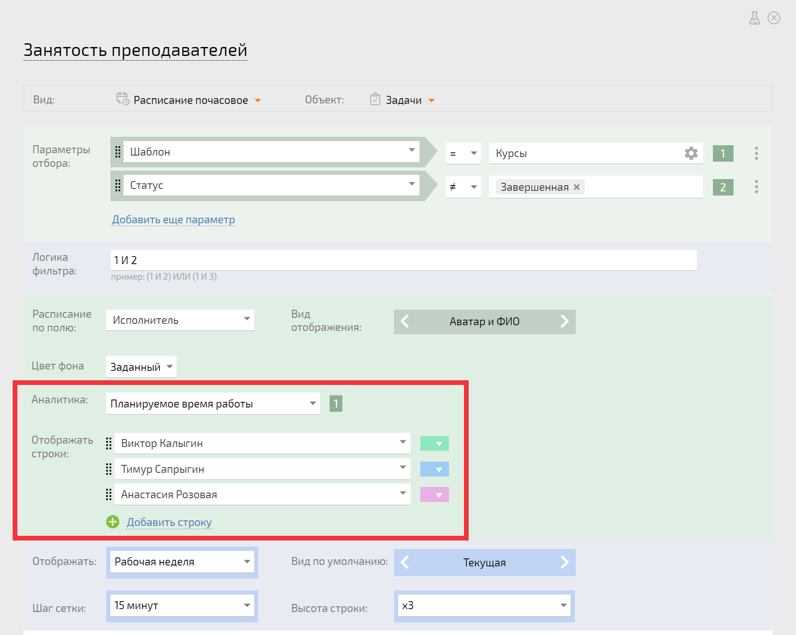

Для полного функционирования конфигурации [Управление курсами](Управление_курсами.md "Управление курсами") следует в настройки расписания **Занятость преподавателей** и календаря **Занятость места проведения** добавить сотрудников. Для этого нужно: 

  * Если сотрудники-преподаватели еще не заведены в ПланФикс, нужно создать [ сотрудников](Сотрудники.md "Сотрудники"), которые будут вести курсы (преподавателей):

  

  * перейти в планировщик **Курсы** для редактирования расписания и календаря:

  

  * указать нужных сотрудников в настройках расписания **Занятость преподавателя** и календаря **Занятость места проведения** , чтобы курс можно было перетаскиванием назначить конкретному преподавателю:

