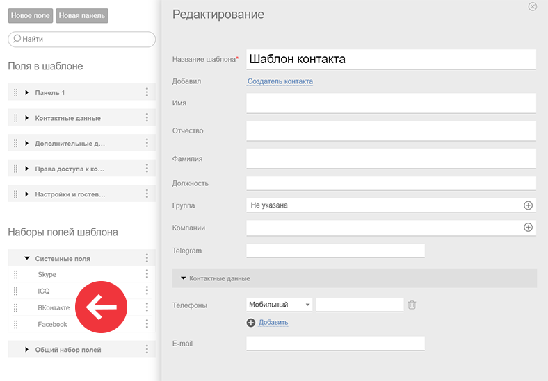
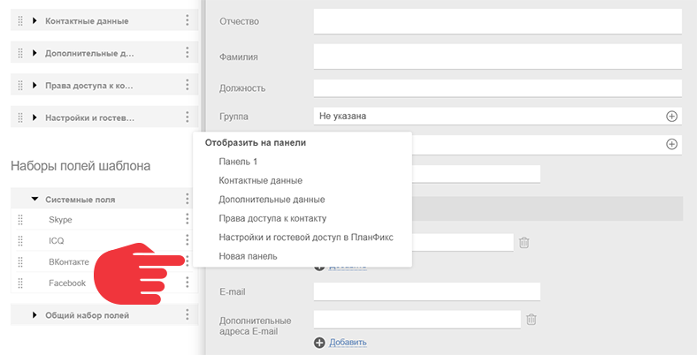
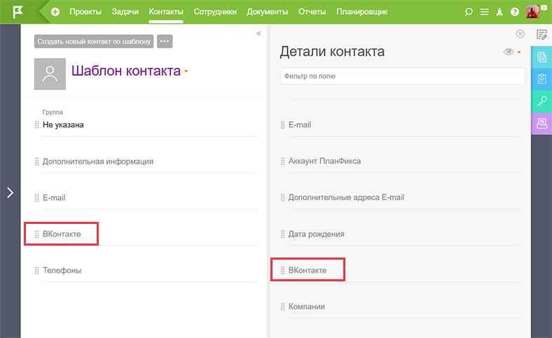

Вы можете добавить ссылку на профиль клиента ВКонтакте в [ карточку контакта](Карточка_контакта.md "Карточка контакта") ПланФикса. 

  * Откройте [шаблон контакта](Шаблоны_контактов.md "Шаблоны контактов") в режиме редактирования и в наборах полей шаблона найдите системное поле **ВКонтакте** :

  

  * Кликните на троеточие рядом с названием поля, выберите панель, на которой будет отображаться поле:

  

  * Поле появится в карточке контакта во вкладке **Детали контакта** :

  

  * При необходимости поле можно перетащить из вкладки **Детали контакта** на основную панель карточки контакта:

