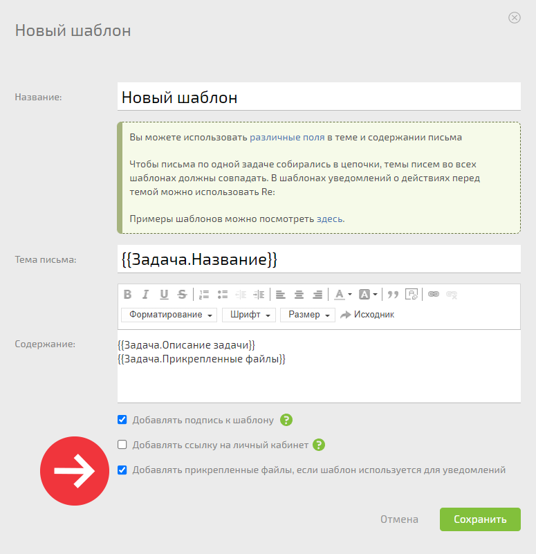

Опция предназначена для добавления файлов в письма-уведомления. Например, можно оповестить контрагента о подготовленных документах и в комментарий задачи добавить нужные файлы. ПланФикс их автоматически прикрепит к письму-уведомлению. 

Опция активируется в [шаблоне письма-уведомления](Шаблоны_писем-уведомлений_для_контактов_без_доступа_в_ПланФикс.md "Шаблоны писем-уведомлений для контактов без доступа в ПланФикс"): 

  

Файлы добавляются в письмо-уведомление: 

  * из комментария задачи;

  * из описания задачи, если отправляется уведомление о создании новой задачи.

  

## Важно

  * Опция работает только в шаблонах писем-уведомлений.

  * В автоматических сценариях и кнопках для добавления файлов используйте переменную. Она явно укажет системе, какие именно файлы отправлять.
