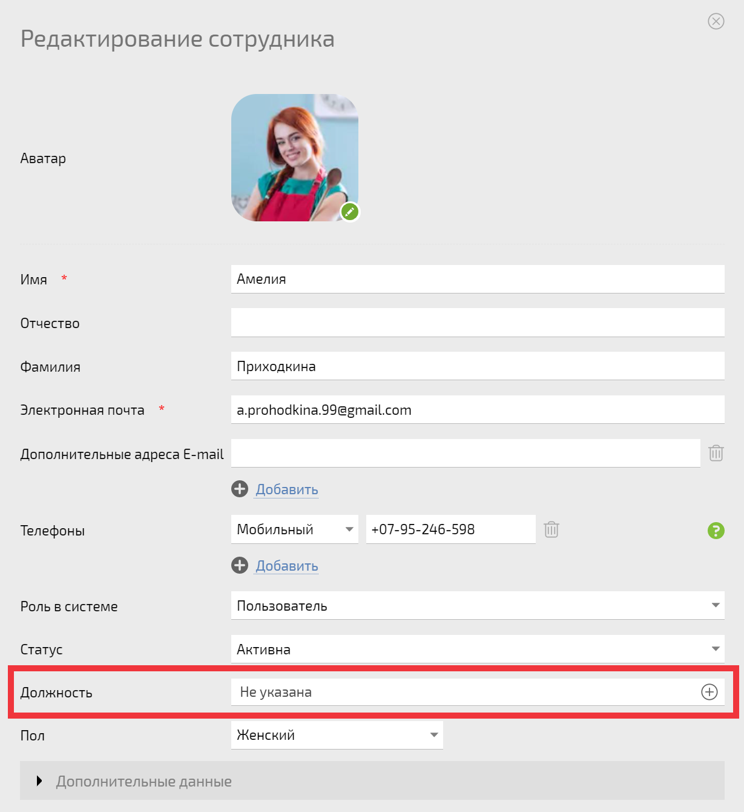
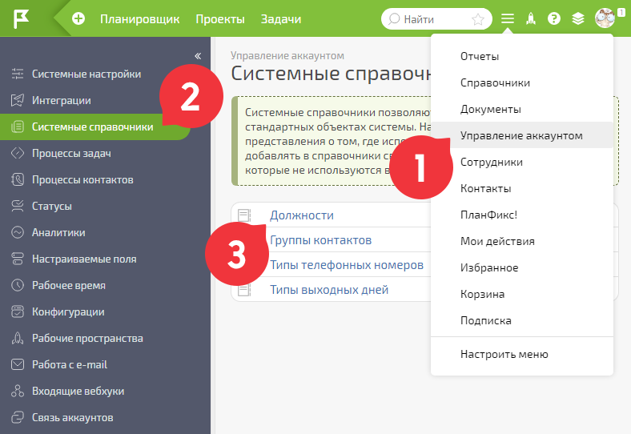
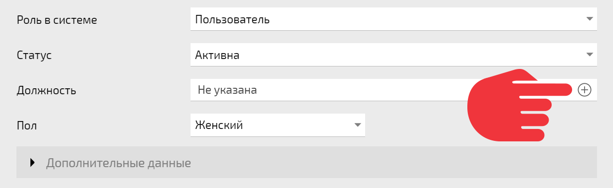
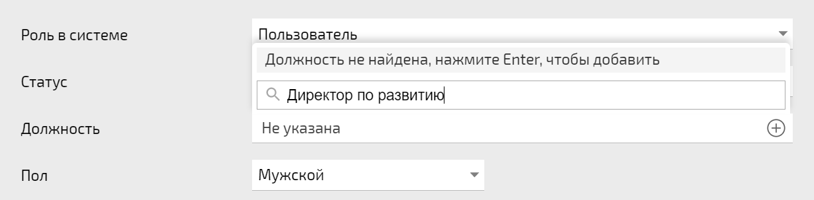

**Должность** можно установить в окне создания или редактирования [ карточки сотрудника](Страница_пользователя.md "Страница пользователя"): 

  

Должность выбирается из списка должностей, который хранится в системном справочнике **Должности**. В новых аккаунтах этот список пуст. 

Для редактирования должности перейдите в **Управление аккаунтом** — **Системные справочники** — **Должности** : 

  

Справочник **Должности** можно заполнять прямо в процессе создания сотрудников, нажимая на пиктограмму с изображением плюса: 

  

Другой способ быстро создать новую должность — ввести ее название прямо в списке и нажать Enter: 

  

Должность отображается в карточке сотрудника, а также в [ Структуре компании](Структура_компании.md "Структура компании"). 

  

## Полезная информация

  * Название должности не дает каких-то дополнительных прав. Чтобы дать руководителю право видеть задачи подчиненных, назначьте его руководителем в [ Структуре компании](Структура_компании.md "Структура компании") или установите в качестве персонального руководителя в [ карточке](Страница_пользователя.md "Страница пользователя") нужного сотрудника.
