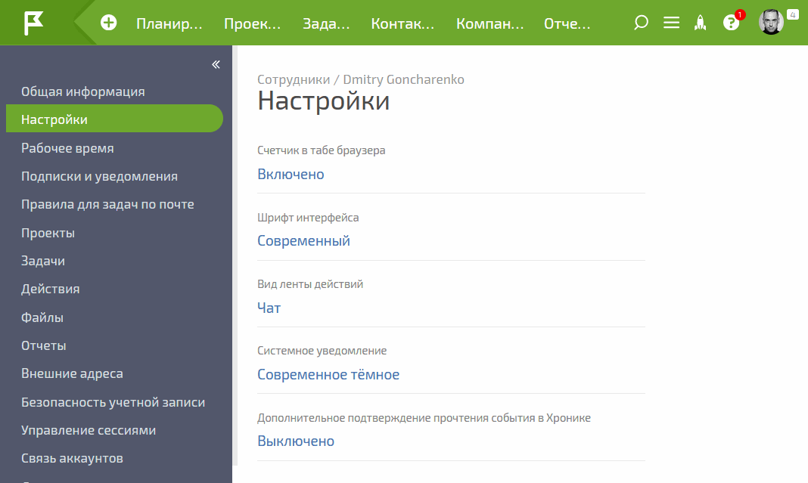

Эта [ настройка в карточке пользователя](Настройки_в_карточке_пользователя.md "Настройки в карточке пользователя") позволяет включить дополнительное подтверждение отметки прочитанным события в [ Хронике](Хроника.md "Хроника"), При включении дополнительного подтверждения система предлагает подтвердить отметку события прочитанным путем повторного нажатия на пиктограмму с изображением зеленой галочки: 

  

Этот вариант защищает пользователя от случайной отметки события прочитанным в ходе работы в Хронике.
