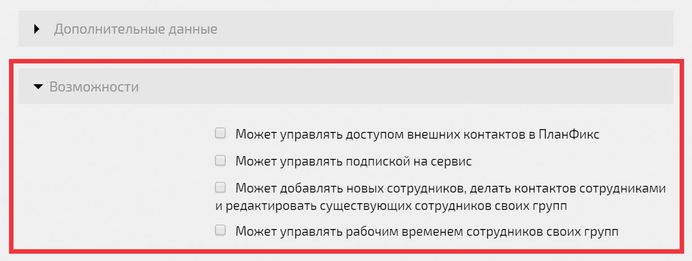

Некоторые дополнительные возможности сотрудников компании можно включать только в режиме редактирования [ карточки пользователя](Страница_пользователя.md "Страница пользователя"): 

  

## Дополнительные возможности сотрудника

  * [ Может управлять доступом внешних контактов в ПланФикс](Сотрудник_может_управлять_доступом_внешних_контактов_в_ПланФикс.md "Сотрудник может управлять доступом внешних контактов в ПланФикс")

  * [ Может управлять подпиской на сервис](Как_дать_сотруднику_права_на_оплату_аккаунта.md "Как дать сотруднику права на оплату аккаунта")

  * [ Может добавлять новых сотрудников, делать контактов сотрудниками и редактировать существующих сотрудников своих групп](Пользователь_может_добавлять_новых_сотрудников.md "Пользователь может добавлять новых сотрудников")

  * [ Может управлять рабочим временем сотрудников своих групп](Пользователь_может_управлять_рабочим_временем_сотрудников_своих_групп.md "Пользователь может управлять рабочим временем сотрудников своих групп")
