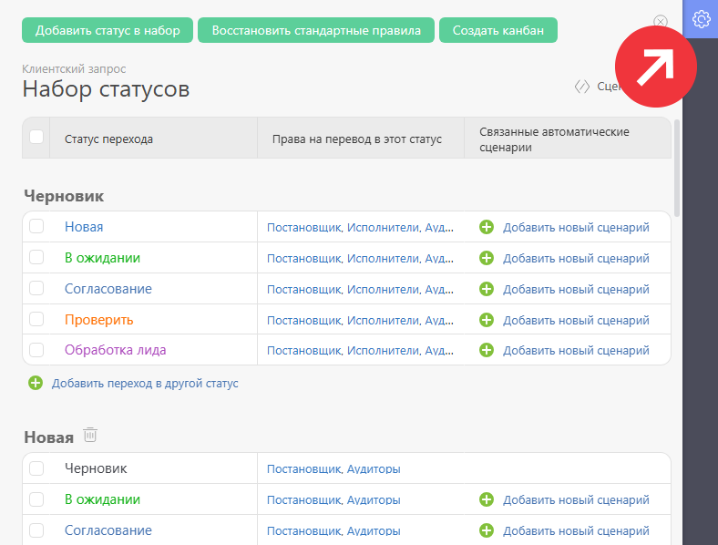

Для каждого [ набора статусов](Создание_набора_статусов.md "Создание набора статусов") можно установить ряд дополнительных параметров. Дополнительные параметры размещены на отдельной панели: 

  

Доступны следующие параметры: 

  * [Статус задачи после принятия](Статус_задачи_после_принятия.md "Статус задачи после принятия").

  * [Автопринятие задачи](Автопринятие_задачи.md "Автопринятие задачи")

  * [Запрет на добавление комментариев к задаче в определенном статусе](Запрет_на_добавление_комментариев_к_задаче_в_определенном_статусе.md "Запрет на добавление комментариев к задаче в определенном статусе")
