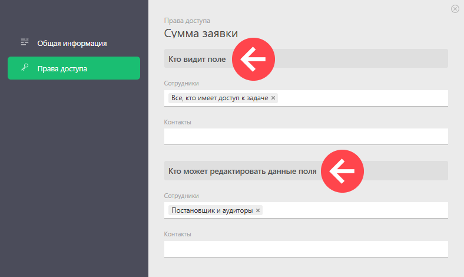
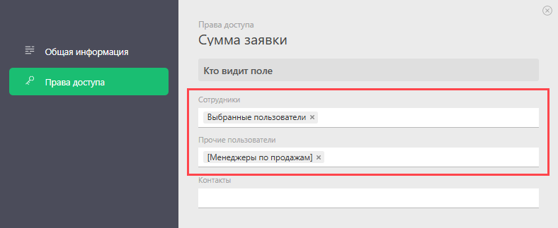

Доступ к [ пользовательским полям](Пользовательские_поля_задачи.md "Пользовательские поля задачи") можно задать сразу при их создании или позже, в разделе **Управление аккаунтом** — **Настраиваемые поля** — **Поля задач**. 

Для каждого поля есть возможность настроить тех сотрудников, клиентов и других [ внешних пользователей](Внешний_пользователь.md "Внешний пользователь") с доступом в ПланФикс, кто может его видеть и редактировать: 

  

**При настройке доступа есть две основные возможности:**

1\. Можно указать роль в задаче/проекте, которая позволяет получить тот или иной доступ: 

  

2\. Можно указать список конкретных пользователей, которые будут иметь доступ к полю вне зависимости от их роли в задаче/проекте: 

  

## Важно

  * У [ полей типа Файлы](Файлы_-_Тип_поля.md "Файлы - Тип поля") нет настроек доступа к полю. Файлы, прикрепленные в задаче любым способом, видят все, кто имеет доступ к этой задаче.

  * Сотрудник с правом доступа к полю типа [«Запись справочника»](Запись_справочника_-_Тип_поля.md "Запись справочника - Тип поля") в задаче будет видеть значение в этом поле в независимости от того, есть ли у него право доступа к Справочнику, содержащему эту запись. При этом перейти в неё он не сможет.
