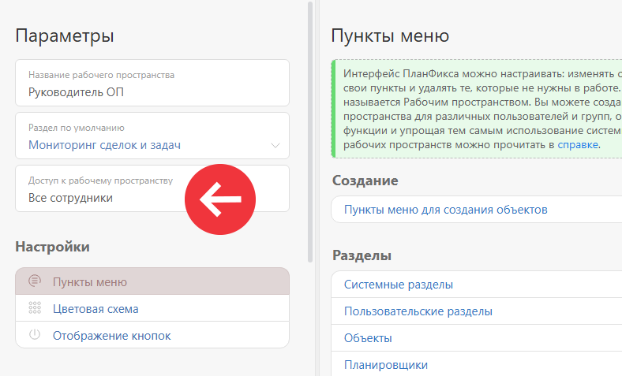
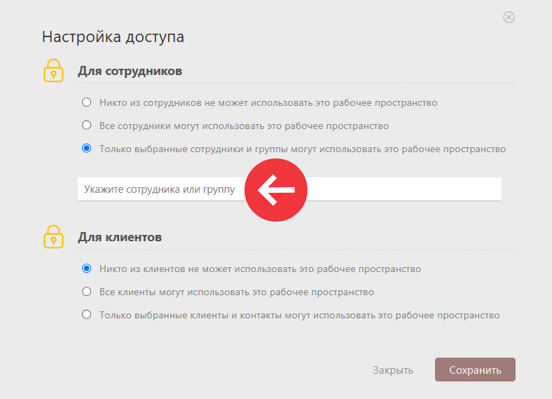

В конфигурации «CRM: Управление сделками 3.0» используется два [рабочих пространства](Рабочие_пространства.md "Рабочие пространства"). После установки конфигурации к рабочим пространствам есть доступ у всех сотрудников. Для ограничения доступа, например, к рабочему пространству руководителя, сделайте следующее: 

  * Перейдите в **рабочее пространство руководителя** и нажмите ссылку **Редактировать текущее пространство** :

  

  * В параметрах рабочего пространства укажите, кто из сотрудников или какие группы сотрудников могут использовать это рабочее пространство:

