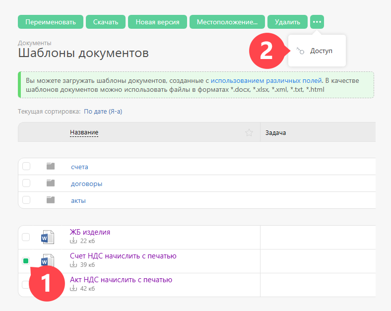

Доступ к шаблону документа регулируется в разделе Документы — Шаблоны документов. Выберите нужный шаблон и настройте доступы: 

  

Как и в случае с доступом к другим документам в ПланФиксе, вы можете определить, кто будет иметь права на просмотр, редактирование и удаление шаблона документа, а также на управление доступом к нему.
